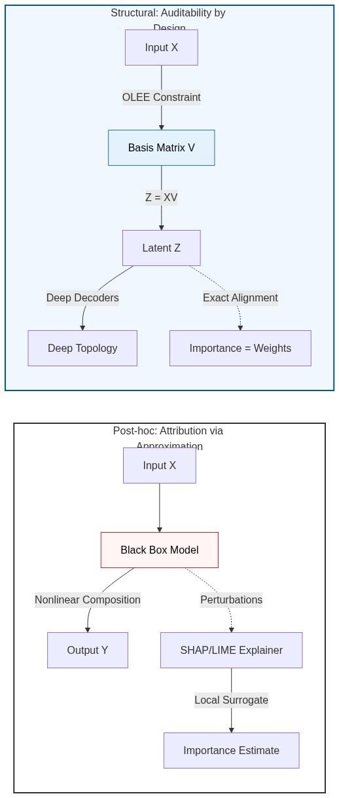

# Introduction and Background

## Introduction

Modern biomedical research increasingly relies on high-throughput multi-modal datasets to capture the complexity of biological systems. Researchers frequently integrate transcriptomics, proteomics, and epigenomics to characterize cellular states or pair structural and functional neuroimaging with clinical metrics to study brain injury [@stone2020longitudinal; @stone2024blast]. These disparate data types, termed *views* or *modalities*, provide complementary technical observations of an underlying shared biological signal. Established frameworks like Advanced Normalization Tools (ANTs) provide the foundation for robust image registration and multi-modal integration in neuroimaging [@avants2011reproducible; @avants2014ants]. 

### Multimodal Consensus as Latent Signal Recovery

We formalize the multi-view integration problem as the recovery of a latent signal $S \in \mathbb{R}^k$ from a collection of $M$ high-dimensional observations $\{X_m\}_{m=1}^M$. We model each view as $X_m = g_m(S) + \epsilon_m$, where $g_m$ represents a view-specific generative process and $\epsilon_m$ denotes modality-specific noise. Effective integration requires a mathematical framework that accounts for the unique covariance structure of each observer while converging on a shared consensus representation $U$ that captures the underlying signal $S$. 

Heterogeneous noise profiles and distinct generative processes complicate this integration. A critical failure mode occurs when "noise-dominant modalities"—high-dimensional data streams lacking structured signal—distort the consensus through accidental correlations. Robust consensus discovery requires a mechanism to identify and suppress these noise sources, ensuring that the discovered representations reflect structured biological signal rather than isotropic artifacts.

Historically, Canonical Correlation Analysis (CCA) [@hotelling1936relations] established the basis for multi-view integration. Similarity-driven Multi-view Linear Reconstruction (SiMLR) generalized CCA by incorporating sparsity and positivity constraints [@Zhao_2011;@Lee_1999], alongside modern optimization techniques that scale to normative modeling and multi-site neuroimaging [@avants2021; @avants2025]. While SiMLR provides a robust foundation, deep learning architectures like Deep CCA (DCCA) [@andrew2013deep] and multi-view autoencoders offer superior predictive performance by modeling nonlinear processes. However, these "black-box" models sacrifice interpretability and remain susceptible to over-fitting in high-dimensional noise regimes.

We resolve the tension between deep learning's expressivity and the transparency required for scientific and regulatory validation. We present a family of architectures (LEND, NED, NEDPP) that implements **Auditability by Design**. These methods enforce an interpretable first layer that learns a linear basis with soft orthogonality constraints, ensuring parts-based feature representations. This approach enables the nonlinear regularization of linear projections, where high-capacity encoders and decoders guide the discovery of optimal linear bases [@CarlesBou2026achieving; @Becker2024hyperparameter]. Furthermore, we introduce the **Spectral Triage** mechanism, which uses a novel **Spectral Sharpness** metric to automatically weight modality contributions, providing a defense against noise-dominant views.

## Background

### Multi-View Representation Learning

Multi-view representation learning seeks a unified latent space $U$ that captures the consensus across $M$ distinct data matrices $\{X_m\}_{m=1}^M$. This process identifies view-specific transformations $f_m(X_m)$ that converge toward $U$ via a shared similarity metric. Linear methods like gCCA and SiMLR rely on projection matrices $V_m$, where the weights directly quantify feature contributions. In contrast, deep multi-view models parametrize $f_m$ as multilayer perceptrons [@Sapkota_2025;@Zhao_2024]. While these models excel at capturing complex structures, they lack **Structural Interpretability**, as nested nonlinearities obscure the relationship between input features $X$ and the latent space [@Schennach2019independent; @Chiueh1988learning]. 

### The Linear Projection Constraint: Structural Interpretability

To restore transparency to deep multi-view learning, we enforce a **Linear Projection Constraint** as a foundational architectural requirement. This constraint governs the model's entry point:

1.  **Only Linear Encoder Entry (OLEE):** The model's initial operation is a mandatory linear transformation $Z_m = X_m V_m$. This OLEE constraint applies universally across our architectural taxonomy (LEND, NED, NEDPP).
2.  **Orthonormal Basis and the Stiefel Manifold:** We restrict the basis $V_m$ to the **Stiefel manifold** — the set of all orthonormal $k$-frames in $\mathbb{R}^{d_m}$, defined by the constraint $V_m^\top V_m = I_k$. This ensures the discovery of non-redundant, near-orthonormal features.
3.  **Direct Feature Attribution:** By restricting the initial encoding step, we ensure that every downstream latent factor $Z$ is a direct linear combination of the input features $X$. This makes $V$ a globally interpretable weight matrix.

This architecture ensures that interpretability is a **structural property of the system**. High-stakes decision-making in medicine and science demands inherently interpretable models rather than post-hoc approximations [@Rudin_2019]. Widespread post-hoc methods like LIME [@Ribeiro_2016] and SHAP [@Lundberg_2017] attempt to reverse-engineer feature attribution by fitting local surrogate models. However, these approximations suffer from instability and often fail to reflect the true mechanics of entangled networks.

In contrast, our framework provides **Auditability by Design**. The weights in the basis $V_m$ represent the exact global importance of each feature [@Smith2023posthoc]. Furthermore, this structural guarantee enables precise **counterfactual reasoning** [@Wachter_2017]. In scientific discovery, researchers often ask: *"What is the minimal change in input features required to alter the model's consensus?"* Because we project features linearly before any nonlinear mixing occurs, we define the answer analytically rather than empirically, allowing for exact, verifiable counterfactuals.

::: {#fig-interpretability-gap}

::: {.content-visible when-format="html"}
```{mermaid}
#| fig-width: 6
#| fig-align: center
graph LR
    subgraph PostHoc [Post-hoc: Attribution via Approximation]
        direction TB
        InputP[Input X] --> BlackBox[Black Box Model]
        BlackBox -->|Nonlinear Composition| OutputP[Output Y]
        BlackBox -.->|Perturbations| Explainer[SHAP/LIME Explainer]
        Explainer -->|Local Surrogate| Guess[Importance Estimate]
    end

    subgraph Structural [Structural: Auditability by Design]
        direction TB
        InputM[Input X] -->|Linear Entry| SparseWeights["Basis Matrix V"]
        SparseWeights -->|Z = XV| Latent[Latent Z]
        Latent -->|Deep Heads/Decoders| Meaning["Deep Topology"]
        Latent -.->|Exact Alignment| Exact["Importance = Weights"]
    end
    
    style PostHoc fill:#ffffff,stroke:#333,stroke-width:2px
    style Structural fill:#f0f7ff,stroke:#01579b,stroke-width:2px
    style SparseWeights fill:#e3f2fd,stroke:#1976d2,color:#000
    style BlackBox fill:#fff5f5,stroke:#c62828,color:#000
```
:::

::: {.content-visible when-format="pdf"}

:::

The Interpretability Paradigm Shift. Post-hoc methods estimate importance by perturbing a black box. SiMLR's Structural Interpretability enforces importance by design through the Only Linear Encoder Entry (OLEE).
:::

### Summary of Contributions

We rank our scientific and methodological contributions as follows:

1.  **Operationalizing "Auditability by Design" via the OLEE:** We demonstrate that deep representational capacity and mathematical transparency are compatible. Across our architectural taxonomy (LEND, NED, NEDPP), enforcing a near-orthogonal initial linear projection provides analytically exact feature importance and enables structural interpretability. This linear bottleneck performs feature discovery, while deep extensions handle manifold complexities without compromising the auditable foundation.
2.  **Spectral Triage and Robust Consensus:** We introduce a consensus mechanism that utilizes **Spectral Sharpness** to detect and suppress noise-dominant views. This **Modality Alignment Index (MAI)** automatically down-weights views that fail to provide structured signal, ensuring the stability of the shared representation.
3.  **Manifold Regularization via NSA-Flow:** We utilize **Non-negative Stiefel Approximating Flow (NSA-Flow)** to provide a stable penalty that enforces approximate orthogonality on the linear encoding layer. This prevents feature collapse and guarantees that each discovered latent factor represents a unique signal.
4.  **Methodological Correctives for Model Selection:** We apply statistical guardrails, including Tracy-Widom distributions, BIC, and the One-Standard-Error rule, to ensure discovered models are rigorously validated.
5.  **Shared-Private Disentanglement:** We engineer a shared-private partitioning mechanism using cross-covariance penalties. This explicitly separates modality-specific idiosyncratic noise from the true cross-modal consensus signal.

### Architectural Taxonomy and Visual Roadmap

We evaluate our framework across four distinct algorithmic rationales:

*   [**SiMLR (Purely Linear - Blue):**]{style="color: #1f77b4; font-weight: bold;"} The baseline for spectral integrity and Gaussian data.
*   [**LEND (Mixed Architecture - Green):**]{style="color: #2ca02c; font-weight: bold;"} Our minimal deep extension combining a linear encoder for discovery with a deep decoder for nonlinear denoising.
*   [**NED (Fully Nonlinear - Orange):**]{style="color: #ff7f0e; font-weight: bold;"} The upper bound for representational capacity, still adhering to the OLEE constraint.
*   [**NEDPP (Shared/Private - Purple):**]{style="color: #9467bd; font-weight: bold;"} Disentangling cross-modal consensus from view-specific idiosyncratic noise via a shared-private decomposition of the latent space.


Section 2 formalizes the SiMLR objective and loss functions, detailing our architectural taxonomy. Section 3 conducts synthetic experiments to evaluate the consistency-interpretability tradeoff and applies these models to a clinical breast cancer (BRCA) study. Section 4 discusses the implications for explainable multi-omics integration and clinical translation.
