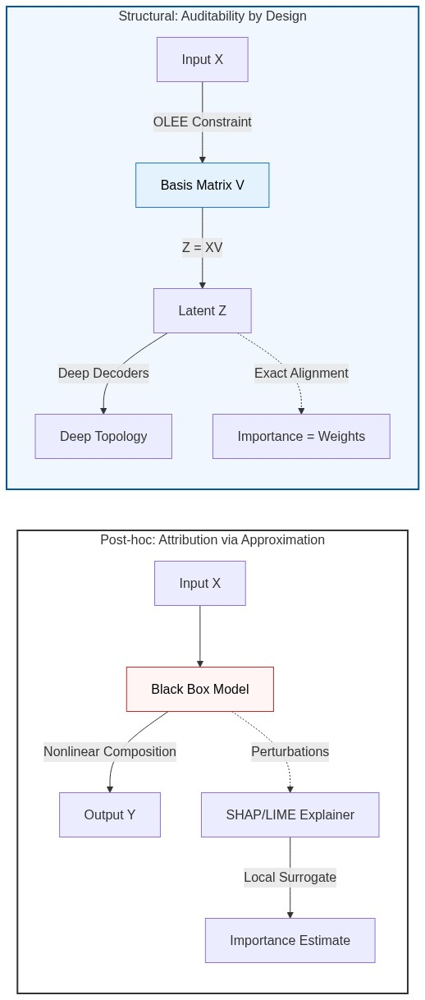

## Introduction

High-throughput multi-modal datasets provide complementary observations of shared biological signals. Integrating these distinct data streams—formalized as *views* or *modalities* $\mathbf{X}_m \in \mathbb{R}^{N \times D_m}$ across $m = 1, \dots, M$—is essential for defining complex phenotypes in neuroimaging and genomics [@stone2020longitudinal; @avants2014ants; @avants2021]. Deep representation learning techniques, including Deep Canonical Correlation Analysis (Deep CCA) [@andrew2013deep], Multi-Omics Factor Analysis extensions (MOFA+) [@argelaguet2020mofa], and Multimodal Variational Autoencoders (MVAEs) [@wu2018multimodal], achieve high predictive accuracy by modeling non-linear covariance structures. However, standard deep autoencoders and CCA extensions project inputs through deeply nested non-linearities, entangling biological features and incurring a severe **transparency penalty** [@Rudin_2019]. In high-stakes scientific and clinical domains, black-box latent representations preclude the verifiable feature attribution required to validate therapeutic targets, assess surgical margins, or satisfy regulatory safety standards. Normalizing Flows [@rezende2015variational; @dinh2016density] offer an alternative by constructing bijective, information-preserving coordinate transformations; however, unconstrained flow architectures remain non-linear coordinate mixtures that obscure raw physical attribution.

To eliminate this transparency penalty without sacrificing non-linear representational capacity, we formulate Deep SiMLR. We enforce Auditability by Design through two core architectural mechanisms. First, we impose an Information Bottleneck termed the **Only Linear Encoder Entrypoint (OLEE)**. OLEE mandates that the initial transformation of any modality $\mathbf{X}_m$ is an orthogonal projection onto a basis $\mathbf{V}_m$ restricted to the compact Stiefel manifold $\text{St}(K, D_m) = \{\mathbf{V}_m \in \mathbb{R}^{D_m \times K} : \mathbf{V}_m^\top \mathbf{V}_m = \mathbf{I}_K\}$. This ensures that the entry point to any downstream non-linear network or normalizing flow is a strictly linear, auditable coordinate system $\mathbf{Z}_m = \mathbf{X}_m \mathbf{V}_m$, preserving closed-form directional derivatives $\nabla_{\mathbf{X}_m} \mathbf{Z}_m = \mathbf{V}_m$. Second, to prevent high-dimensional isotropic noise from corrupting consensus formation, we derive a **Spectral Triage** mechanism. By evaluating a Modality Alignment Index (MAI) grounded in Spectral Sharpness ($\sigma_1 / \sum \sigma_i$), this mechanism systematically down-weights noise-dominant modalities during consensus discovery. Together, OLEE and Spectral Triage yield an architectural continuum that matches the empirical predictive capacity of deep networks while preserving closed-form feature attribution and verifiable geometric invariants.

### Multimodal Consensus as Latent Signal Recovery

We formalize multi-view integration as the recovery of a shared latent signal $\mathbf{S} \in \mathbb{R}^{N \times K}$ from a collection of $M$ high-dimensional observations $\{\mathbf{X}_m\}_{m=1}^M$, where each view is generated according to:
$$\mathbf{X}_m = g_m(\mathbf{S}) + \mathbf{E}_m$$
Here $g_m: \mathbb{R}^{N \times K} \to \mathbb{R}^{N \times D_m}$ denotes a modality-specific generative function and $\mathbf{E}_m$ represents additive observation noise. Multi-modal consensus discovery seeks view-specific mappings $f_m(\mathbf{X}_m)$ that map each observation to a unified latent consensus representation $\mathbf{U} \in \mathbb{R}^{N \times K}$ approximating $\mathbf{S}$.

Heterogeneous noise distributions and disparate dimensionalities complicate consensus recovery. A primary failure mode occurs when high-dimensional modalities lacking structured covariance—termed noise-dominant views—introduce spurious correlations that distort the consensus space. Principled multi-modal integration requires structural regularization that attenuates isotropic noise sources, ensuring that derived representations reflect genuine shared biology rather than high-dimensional artifacts [@avants2025; @stone2024blast].

Historically, Canonical Correlation Analysis (CCA) [@hotelling1936relations] established the statistical foundation for multi-view linear alignment. Similarity-driven Multimodal Linear Reconstruction (SiMLR) generalized CCA by introducing sparsity and non-negativity constraints [@Zhao_2011; @Lee_1999], alongside Riemannian optimization algorithms tailored for large-scale biomedical cohorts [@avants2021]. While linear SiMLR provides guaranteed interpretability and robust numerical scaling, complex biological processes often exhibit non-linear manifold structures that exceed linear representational capacity. Conversely, unconstrained deep multi-view networks capture non-linear geometries but sacrifice mechanistic transparency and overfit in noise-dominant regimes.

We bridge this divide between non-linear expressivity and scientific auditability. We formulate a family of architectures that implements Auditability by Design: linear projection matrices $\mathbf{V}_m$ are regularized directly on the Stiefel manifold, establishing parts-based representations while high-capacity non-linear decoders or normalizing flows accommodate complex downstream manifold geometry [@Wen_2012; @boumal2023introduction].

## Background

### Multi-View Representation Learning and the Transparency Penalty

Multi-view representation learning derives a unified latent coordinate system $\mathbf{U}$ capturing shared covariance across $M$ distinct observations $\{\mathbf{X}_m\}_{m=1}^M$. Linear formulations compute projection matrices $\mathbf{V}_m$, where each coefficient $V_{m,jk}$ directly represents the physical weighting of feature $j$ on latent component $k$. Deep multi-view models parametrize $f_m$ as multi-layer perceptrons [@Sapkota_2025; @Zhao_2024]. While deep encoders model non-linear interactions, they collapse distinct biological inputs into entangled latent spaces [@Schennach2019independent].

In clinical diagnostics and precision medicine, this loss of transparency incurs unacceptable operational risks [@Rudin_2019]. Post-hoc explainability methods, including LIME [@Ribeiro_2016] and SHAP [@Lundberg_2017], attempt to recover attribution by fitting local surrogate models to randomly perturbed inputs. As established by Rudin (2019), post-hoc approximations are fundamentally limited in high-stakes environments: they lack stability, exhibit sensitivity to hyperparameter choices, and suffer from an out-of-distribution (OOD) perturbation flaw. By perturbing biological features independently, post-hoc methods evaluate synthetic data points that violate physiological covariance (e.g., pairing impossible blood pressure and vascular resistance values). Consequently, post-hoc saliency maps can generate misleading clinical explanations [@Holmberg_2022].

### Information Bottleneck and Structural Interpretability

To eliminate the transparency penalty and restore mathematical auditability to deep multi-view learning, we formulate the **Only Linear Encoder Entrypoint (OLEE)**. OLEE functions as a structural Information Bottleneck that bounds deep representation learning directly at the input manifold:

1.  **Only Linear Encoder Entrypoint (OLEE):** The initial transformation of modality $\mathbf{X}_m$ is strictly linear: $\mathbf{Z}_m = \mathbf{X}_m \mathbf{V}_m$, where $\mathbf{V}_m \in \mathbb{R}^{D_m \times K}$. All subsequent non-linear transformations (decoders, prediction heads, or bijective flows) consume $\mathbf{Z}_m$, never raw inputs $\mathbf{X}_m$.
2.  **Stiefel Manifold Orthonormality:** We constrain projection matrices to the compact Stiefel manifold $\text{St}(K, D_m)$, enforcing $\mathbf{V}_m^\top \mathbf{V}_m = \mathbf{I}_K$. This constraint is maintained via Sylvester polar factor retractions or Non-negative Stiefel Approximating Flow (NSA-Flow), preventing feature collapse and bounding the Frame Defect $D(\mathbf{V}_m) = \|\mathbf{V}_m^\top \mathbf{V}_m - \mathbf{I}_K\|_F^2 \approx 0$.
3.  **Closed-Form Feature Attribution and Exact Counterfactuals:** Because $\mathbf{Z}_m = \mathbf{X}_m \mathbf{V}_m$, the attribution gradient is identically constant across the input domain:
    $$\frac{\partial \mathbf{Z}_{m,k}}{\partial X_{m,j}} = V_{m,jk}$$
    The weights within $\mathbf{V}_m$ serve as globally exact feature loadings [@Smith2023posthoc]. This property enables exact, perturbation-free counterfactual reasoning [@Wachter_2017]: computing the minimal input adjustment $\delta \mathbf{X}_m$ necessary to produce a desired latent shift $\Delta \mathbf{Z}_m$ reduces to an analytical projection $\delta \mathbf{X}_m = \Delta \mathbf{Z}_m \mathbf{V}_m^\top$, eliminating out-of-distribution sampling artifacts.
4.  **Subspace Invariance versus Basis Axis Sensitivity:** We distinguish between the *subspace* spanned by $\mathbf{X}_m \mathbf{V}_m$ and the individual *basis axes*. For any orthogonal rotation $\mathbf{M} \in O(K)$, linear regression on $\mathbf{X}_m \mathbf{V}_m \mathbf{M}$ yields identical predictions to $\mathbf{X}_m \mathbf{V}_m$, demonstrating rotational subspace invariance. Conversely, identifying individual biological biomarkers requires coordinate-sensitive probes (such as tree ensembles) and non-negative support consolidation ($\mathbf{V}_m^+ \odot \mathbf{V}_m^- = \mathbf{0}$) to eliminate destructive attribution cancellation between positive and negative lobes.

::: {#fig-interpretability-gap}

::: {.content-visible when-format="html"}
```{mermaid}
#| fig-width: 6
#| fig-align: center
graph LR
    subgraph PostHoc [Post-hoc: Attribution via Approximation]
        direction TB
        InputP[Input X] --> BlackBox[Black Box Deep Model]
        BlackBox -->|Nonlinear Entanglement| OutputP[Output Y]
        BlackBox -.->|OOD Perturbations| Explainer[SHAP / LIME Surrogate]
        Explainer -->|Surrogate Approximation| Guess[Heuristic Attribution]
    end

    subgraph Structural [Structural: Auditability by Design]
        direction TB
        InputM[Input X] -->|OLEE Constraint| StiefelBasis["Stiefel Basis V (V^T V = I)"]
        StiefelBasis -->|Z = XV| Latent[Auditable Latent Z]
        Latent -->|Deep Decoders / Flows| DeepMap["Non-linear Manifold"]
        Latent -.->|Exact Linear Gradient| Exact["Attribution: dZ/dX = V"]
    end
    
    style PostHoc fill:#ffffff,stroke:#333,stroke-width:2px
    style Structural fill:#f0f7ff,stroke:#01579b,stroke-width:2px
    style StiefelBasis fill:#e3f2fd,stroke:#1976d2,color:#000
    style BlackBox fill:#fff5f5,stroke:#c62828,color:#000
#| fig-cap: 'The Interpretability Paradigm Shift. Post-hoc explainers perturb complex models off-manifold to approximate feature importance. Deep SiMLR enforces Auditability by Design through the Only Linear Encoder Entrypoint (OLEE) on the Stiefel manifold, eliminating the clinical transparency penalty.'
```
:::

::: {.content-visible when-format="pdf"}

:::
:::

### Summary of Methodological Contributions

We summarize the methodological contributions of this work:

1.  **Eliminating the Transparency Penalty via OLEE:** We establish the compatibility of deep representational capacity and exact linear auditability. Across all architectures, constraining the initial layer to an orthogonal Stiefel projection provides globally exact feature attributions and closed-form counterfactual explanations.
2.  **Spectral Triage and Robust Consensus:** We formulate a consensus mechanism utilizing **Spectral Sharpness** ($\sigma_1 / \sum \sigma_i$) to evaluate the **Modality Alignment Index (MAI)**, systematically attenuating noise-dominant modalities during consensus discovery.
3.  **Manifold Regularization via Polar Retractions and NSA-Flow:** We deploy Sylvester equation polar factor retractions and Non-negative Stiefel Approximating Flow (NSA-Flow) to enforce orthonormality ($\mathbf{V}^\top \mathbf{V} = \mathbf{I}_K$) and support consolidation ($\mathbf{V}^+ \odot \mathbf{V}^- = \mathbf{0}$), eliminating frame defect and lobe crosstalk.
4.  **Quasi-Newton Riemannian Optimization:** We introduce `SiMLR-LBFGS`, incorporating two-loop recursion L-BFGS curvature steps directly on the Stiefel manifold to close the performance gap between linear and deep architectures.
5.  **Leave-One-Out (LOO) Consensus Topology:** We formulate Leave-One-Out (LOO) target construction during consensus alignment, preventing deep encoders from memorizing modality-specific idiosyncratic variance.
6.  **Multi-Objective Pareto Characterization:** We formalize architecture selection across a 4-axis multi-objective space (Predictive Power, Latent Discovery, Geometric Invariants, Latency), demonstrating that `Flow-SiMLR-V`, `SiMLR-LBFGS`, `SiMLR`, and `NSAFlow-Turnkey` define the non-dominated Pareto frontier.
7.  **Invertible Integration and Geodesic Paths:** We formulate **Flow-SiMR-V**, integrating bijective normalizing flows with OLEE linear bottlenecks to enable exact Gaussian conditional inference and continuous geodesic counterfactual trajectories in clinical cohorts.

### Architectural Taxonomy

We evaluate this framework across a systematic taxonomy spanning linear, deep, and bijective formulations:

*   [**SiMLR (Classical Linear - Blue):**]{style="color: #1f77b4; font-weight: bold;"} The strictly linear baseline utilizing Riemannian gradient descent on the Stiefel manifold, providing maximal computational throughput ($\sim 100$ ms latency).
*   [**SiMLR-LBFGS (Quasi-Newton Linear - Navy):**]{style="color: #000080; font-weight: bold;"} An advanced linear architecture employing quasi-Newton L-BFGS curvature steps on the Stiefel manifold, closing the linear-to-deep predictive performance gap without non-linear decoders.
*   [**LEND (Linear Encoder, Non-linear Decoder - Green):**]{style="color: #2ca02c; font-weight: bold;"} A hybrid architecture coupling an OLEE-constrained linear encoder for feature attribution with a deep MLP decoder for non-linear manifold reconstruction.
*   [**NED (Non-linear Encoder-Decoder - Orange):**]{style="color: #ff7f0e; font-weight: bold;"} A deep architecture applying multi-layer perceptrons subsequent to the mandatory OLEE linear projection bottleneck.
*   [**NEDPP (Disentangled Shared/Private - Purple):**]{style="color: #9467bd; font-weight: bold;"} A structured deep architecture that explicitly partitions latent coordinates into shared consensus and modality-specific private subspaces using cross-covariance penalties.
*   [**NSAFlow-Turnkey (Rigid Manifold Flow - Red):**]{style="color: #d62728; font-weight: bold;"} A turnkey Stiefel flow architecture enforcing strict frame defect bounds ($D = 0.0000$) and signed support consolidation ($\mathbf{V}^+ \odot \mathbf{V}^- = \mathbf{0}$) to maximize ground-truth latent recovery.
*   [**Flow-SiMR / Flow-SiMR-V (Bijective Normalizing Flow - Teal):**]{style="color: #008080; font-weight: bold;"} An invertible architecture utilizing volume-preserving affine coupling layers prepended with an OLEE Stiefel projection matrix, achieving leading predictive power and enabling continuous geodesic clinical trajectories.

Section 2 provides the mathematical derivations for the joint-variational objective, Stiefel retractions, quasi-Newton optimization, and geometric invariants. Section 3 reports empirical evaluations across the 490-task benchmark cache. Section 4 examines multi-objective Pareto trade-offs and translational implications for neuroimaging and oncology.