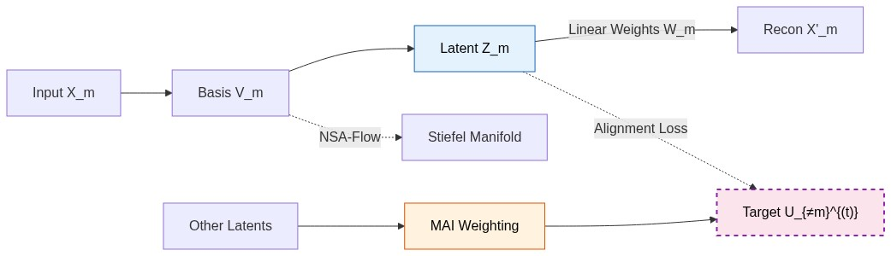
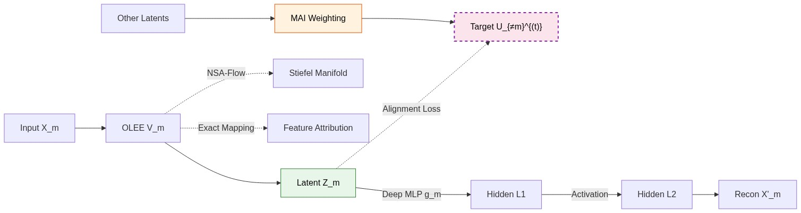
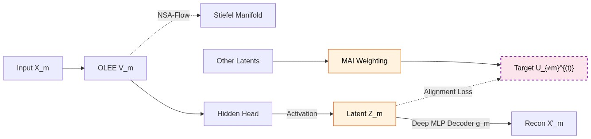
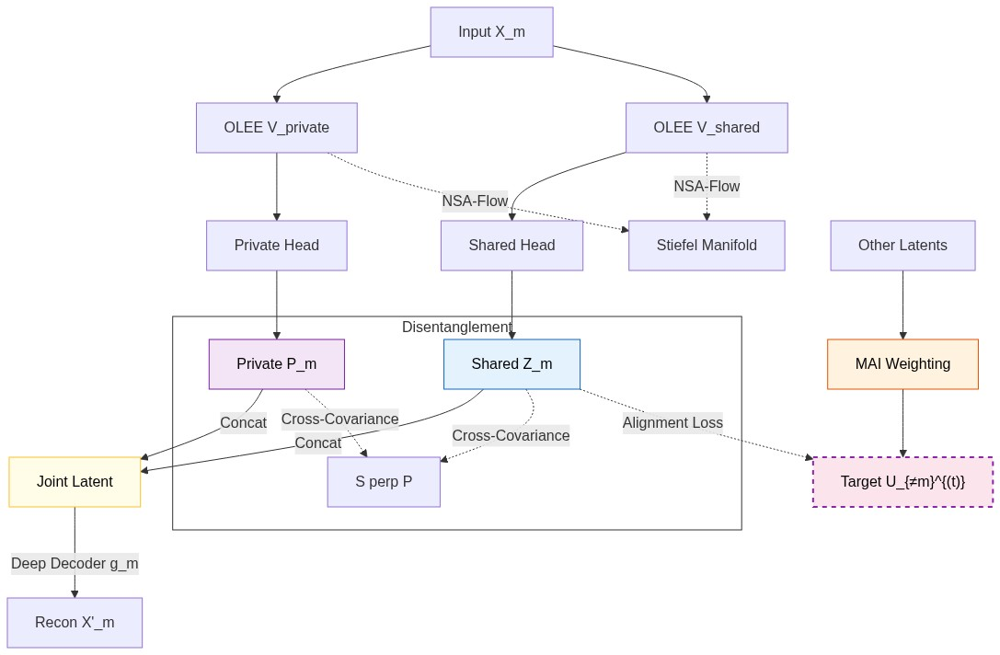

## Technical Foundation

### Architectural Rationale: The Multi-Observer Sketch Problem

Multi-modal integration can be viewed as a \"multi-observer sketch problem.\" Consider a central, potentially complex object that may be construed as a high-dimensional manifold representing a system's true underlying state (e.g., patient health) that cannot be directly observed. To approximate this inaccessible object, we rely on a **Multimodal Consensus Basis**, where each modality acts as an observer with a unique but limited sensorium. One observer might record the low-frequency acoustic vibrations (clinical demographics), another might capture the high-frequency electromagnetic scatter (gene expression profiles), and yet another might trace the topological representation variations (medical imaging). Each observer produces a "sketch" of the central object.  Crucially, each \"sketch\" is corrupted by observer-specific noise, viewing angles, and sensory limitations. The core challenge is synthesizing these disparate, noisy sketches into a coherent, shared representation of the true central object. 

### Joint-Variational Optimization Framework

SiMLR addresses this by formulating a generalized, joint-variational optimization objective, building upon principles from Normative Neurological Health Embedding (NNHEmbed) and advanced multi-modal integration [@avants2025]. We define a framework where linear, non-linear, and shared-private architectures harmonize to optimize a unified goal. 

Let $M$ be the number of modalities. For each modality $m \in \{1, \dots, M\}$, let $X_m \in \mathbb{R}^{n \times d_m}$ be the input data matrix, where $n$ is the number of samples and $d_m$ is the feature dimension of the $m$-th modality. We seek to learn an encoder $f_m: \mathbb{R}^{d_m} \to \mathbb{R}^k$ and a decoder $g_m: \mathbb{R}^k \to \mathbb{R}^{d_m}$. We denote the latent representation (scores) as $Z_m = f_m(X_m) \in \mathbb{R}^{n \times k}$ and the reconstruction as $\hat{X}_m = g_m(Z_m)$.

The fundamental SiMLR objective is to minimize a joint loss function $\mathcal{L}$ that balances intra-modality reconstruction, inter-modality alignment, and representation stability via discrete penalty weights (e.g., $\lambda_{\text{sim}}, \lambda_{\text{var}}, \lambda_{\text{cov}}$):

$$
\mathcal{L}(\{f_m, g_m\}, U) = \sum_{m=1}^M \mathcal{L}_{\text{recon}}(X_m, \hat{X}_m) + \lambda_{\text{sim}} \sum_{m=1}^M \mathcal{L}_{\text{align}}(Z_m, \text{detach}(U)) + \lambda_{\text{var}} \mathcal{L}_{\text{var}} + \lambda_{\text{cov}} \mathcal{L}_{\text{cov}} + \gamma \sum_{m=1}^M \Omega(V_m)
$$

Specifically, these loss components are defined as follows:

*   $\mathcal{L}_{\text{recon}}(X_m, \hat{X}_m) = \| X_m - \hat{X}_m \|_F^2$ enforces that the learned representations retain sufficient information to reconstruct the original input features.
*   $\mathcal{L}_{\text{align}}(Z_m, \text{detach}(U))$ measures the cross-modal alignment of each latent space to a consensus space $U$. We utilize a **Leave-One-Out (LOO) topology** by default, where modality $m$ aligns against the consensus of all *other* modalities ($U_{\neq m}$). This strict cross-modal prediction pathway acts as a powerful structural regularizer, preventing high-capacity deep networks from "cheating" by memorizing their own idiosyncratic noise. A computationally simpler "star-topology" (where all modalities align to a single shared $U$) is also supported for faster approximation with $O(M)$ complexity.
*   $\mathcal{L}_{\text{var}} = \sum_{m=1}^M (1 - \text{Var}(Z_m))^2$ acts as a variance regularization term, ensuring that the latent projections do not collapse and maintain unit variance.
*   $\mathcal{L}_{\text{cov}}$ penalizes off-diagonal elements in the covariance matrix of $Z_m$, encouraging disentangled, independent latent factors within each modality.
*   $\Omega(V_m)$ represents the structural constraint on the encoder's linear basis. We apply Non-negative Stiefel approximating flow (NSA-Flow) to strictly constrain the initial projection matrix $V_m$ to the Stiefel manifold ($V_m^T V_m = I_k$), ensuring orthogonal, non-redundant feature discovery.

This formalizes our constrained optimization problem: minimizing $\mathcal{L}(\theta, U)$ subject to $V_m \in \text{Stiefel Manifold}$ for all $m$.

This generalized formulation directly encapsulates the classical SiMLR model as a specific derivation. By defining the encoder as a strictly linear mapping $f_m(X_m) = X_m V_m$ and the decoder as a corresponding linear mapping $g_m(Z_m) = Z_m W_m$, the general objective distills to the exact linear trace optimizations of the original method. Building upon this flexible foundation, we construct a taxonomy of architectures—each defining $f_m$ and $g_m$ differently to traverse the continuum from interpretable linear projections to high-capacity deep manifold learning.

The multi-view objectives $\mathcal{L}_{\text{align}}(Z_m, Z_l)$ will ideally ensure consistency between latent representations while remaining invariant to nuisance transformations [@wang2015deep; @bach2002kernel].  The framework supports multiple similarity energies:

1. **Regression:** Mean squared error between normalized latents and consensus. This assumes a Gaussian noise distribution and strictly penalizes magnitude differences, pulling the modality-specific projection directly toward the consensus coordinate.

2. **ACC:** Negative sum of absolute covariances. Absolute Canonical Covariance (ACC) encourages shared alignment by maximizing the unnormalized inner product with the consensus. It is derived from the Orthogonal Procrustes problem [@schonemann1966generalized] $\min_{R^T R = I} \| Z_m - U R \|_F^2$ and is highly effective when signal magnitude correlates with signal quality:
$$ \mathcal{L}_{ACC} = - \frac{1}{M} \sum_{m=1}^M \text{Tr}(Z_m^T U) $$

3. **NC:** Normalized correlation (Procrustes correlation). Normalized Covariance (NC) prevents modality-starvation by scaling views to unit variance, ensuring that modalities with smaller intrinsic variance contribute equally to the consensus:
$$ \tilde{Z}_m = Z_m \Sigma_m^{-1/2} $$

4. **Log-Cosh:** A robust, ICA-inspired similarity measure. By utilizing the log-cosh approximation of absolute value, this metric bounds outlier influence and encourages statistically independent components within the alignment.


#### The Signal-to-Noise Ratio (SNR) Perspective

The choice between inter-modality loss is a fundamental statistical decision regarding the expected signal-to-noise ratio (SNR) of the input modalities. Below we compare NC and ACC, noting that ACC outperforms NC when the expected noise variance is low and the signal magnitude is trustworthy.

Let $Z_m = S + \epsilon_m$ be the latent representation of modality $m$, where $S \sim \mathcal{N}(0, \Sigma_s)$ is the shared signal and $\epsilon_m \sim \mathcal{N}(0, \Sigma_{n,m})$ is view-specific noise. **ACC** optimizes the unnormalized inner product:
$$ \mathcal{L}_{ACC} \propto - \mathbb{E}[\text{Tr}((S + \epsilon_m)^T (S + \epsilon_l))] = - \text{Tr}(\Sigma_s) $$
while **NC** optimizes the whitened alignment:
$$ \mathcal{L}_{NC} \propto - \text{Tr}\left( (\Sigma_s + \Sigma_{n,m})^{-1/2} \Sigma_s (\Sigma_s + \Sigma_{n,l})^{-1/2} \right) $$

NC prevents "Modality Starvation" by ensuring equal representation, but introduces a "Noise Boosting" risk when $\Sigma_{n,m}$ is large. We formalize this tradeoff as the *Equivariance-Invariance Dilemma*. To mitigate these extremes, Regression enforces Gaussian alignment assumptions, while Log-Cosh provides a robust alternative that inherently bounds outlier influence, offering a balanced approach when the noise distribution is unknown or heavy-tailed.

In the absence of a deep understanding of input modality's statistical properties, the choice of loss must therefore be chosen based on empirical experiments.

### Consensus Formation and Stabilization

#### Newton-Schulz Iteration

Newton-Schulz iteration provides a high-performance alternative to SVD for maintaining latent orthogonality. Its **quadratic convergence** ensures the consensus representation $U$ remains numerically stable across thousands of training epochs. 

A formal proof of the quadratic convergence is detailed in **Appendix A.2.2**.

#### Anchor Map Fix: EMA Consensus Stabilization

In stochastic gradient descent (SGD) optimization of multi-modal systems, the shared latent consensus $U$ can suffer from "representation drift" across mini-batches. This is particularly acute for algorithms like ICA or SVD that are sensitive to the specific samples in a batch. To mitigate this, we introduce the **Anchor Map Fix**, which utilizes an Exponential Moving Average (EMA) to stabilize the consensus projection, a technique closely related to momentum encoders and target networks in deep representation learning [@he2020momentum; @tarvainen2017mean; @polyak1992acceleration].

Let $Z_{cat} \in \mathbb{R}^{n \times MK}$ be the concatenation of latent scores from all $M$ modalities. The raw projection matrix $P_t$ is computed at each step $t$ using the chosen mixing algorithm (e.g., SVD or ICA):
$$ P_t = \text{MixingAlgorithm}(Z_{cat, t}) $$

Instead of using $P_t$ directly to compute the consensus $U_t = Z_{cat, t} P_t$, we maintain a stabilized anchor matrix $A_t \in \mathbb{R}^{MK \times K}$ updated via:
$$ A_t = (1 - \alpha) A_{t-1} + \alpha P_t $$
where $\alpha \in [0, 1]$ is the momentum parameter (typically set to 0.1). The stabilized consensus is then:
$$ U_t = Z_{cat, t} A_t $$

This EMA update acts as a low-pass filter on the consensus manifold, ensuring that the gradient signal remains consistent even when mini-batch statistics are noisy. Statistically, this can be viewed as a temporal regularizer that prevents the model from over-fitting to transient cross-modal correlations in small sample subsets.

### Orthogonal Manifold Optimization via NSA-Flow

Orthogonality prevents feature collapse and ensures distinct latent dimensions. We use **Non-negative Stiefel approximating flow (NSA-Flow)** [@nsaflow2025] to navigate the manifold $\mathbb{V}_{k,n} = \{ V \in \mathbb{R}^{n \times k} \mid V^T V = I_k \}$. 

#### Biomarker Discovery Integrity

The Stiefel constraint is the mathematical guarantor of **Biomarker Discovery Integrity**. By enforcing strict orthogonality via NSA-Flow, SiMLR ensures:
1. **Uniqueness:** Each discovered latent factor represents a statistically unique signal.
2. **Parsimony:** The model is forced to explain the data with non-redundant basis vectors.
3. **Identifiability:** The manifold constraint provides a stable coordinate system necessary for clinical generalizability.

**Visualizing the Manifold Dynamics:** Conceptually, navigating the Stiefel manifold can be envisioned as traversing the rigid surface of a high-dimensional hypersphere. Standard Euclidean gradient descent steps inevitably push our weight matrix $V$ off this curved surface and into the ambient space, resulting in feature collapse. The NSA-Flow penalty $\mathcal{P}(V)$ acts as an manifold regularization objective. Rather than a hard projection, it creates a continuous vector field that smoothly guides the weights back onto the orthogonal surface. This ensures that as the network learns complex representations, it never sacrifices the structural rigidity required for distinct, disentangled feature discovery.

Detailed mathematical proofs regarding the Riemannian geometry and orthogonal penalty expansions are provided in **Appendix A.2.1**.

## II. Specific Examples: Modular Architectural Taxonomy

The SiMLR framework encompasses a rich taxonomy of architectural designs. Below we detail the information flow and constraints for each variant.

**Disclaimer:** The following architectural diagrams illustrate the flow for a single modality arm (modality $m$). In the full multimodal framework, this arm is duplicated $M$ times, with the latent representations interacting across all modalities via the shared alignment constraints and consensus mechanisms detailed in the Joint-Variational Optimization Framework.

### Classical SiMLR (Linear Baseline)

The foundation of the framework, relying on dual linear projections for encoding and decoding.

*   **Encoder:** $f_m(X_m) = X_m V_m$
*   **Decoder:** $g_m(Z_m) = Z_m W_m$

::: {#fig-simlr}

::: {.content-visible when-format="html"}
```{mermaid}
#| fig-width: 6
#| fig-align: center
graph LR
    X[Input X] -->|Linear Basis V| Z[Latent Z]
    Z -->|Linear Weights W| R[Recon X']
    
    subgraph Constraints
        V -.->|NSA-Flow| Stiefel[Stiefel Manifold]
        Z -.->|ACC/NC Loss| Consensus[Shared Alignment]
    end
    
    style Z fill:#e3f2fd,stroke:#1565c0,color:#000
    style Constraints fill:#ffffff,stroke:#333
```
:::

::: {.content-visible when-format="pdf"}

:::

Classical SiMLR Architecture. Both the encoder ($V$) and decoder ($W$) are linear matrices. The encoding basis $V$ is strictly constrained to the Stiefel manifold to ensure feature discovery without redundancy.
:::

### LEND (Linear Encoder, Deep Decoder)

Our primary innovation for scientific discovery, preserving linear interpretability while enabling deep manifold denoising [@vincent2008extracting].

*   **Encoder:** $f_m(X_m) = X_m V_m$
*   **Decoder:** $g_m(Z_m) = \text{MLP}_{\theta_m}(Z_m)$

::: {#fig-lend}

::: {.content-visible when-format="html"}
```{mermaid}
#| fig-width: 6
#| fig-align: center
graph LR
    X[Input X] -->|OLEE V| Z[Latent Z]
    Z -->|Deep MLP g| H1[Hidden L1]
    H1 -->|Activation| H2[Hidden L2]
    H2 --> R[Recon X']
    
    subgraph Interpretability
        V -.->|NSA-Flow| S[Stiefel Manifold]
        V -.->|Exact Mapping| A[Waterfall Audit]
    end

    subgraph Denoising
        H1 -.->|Non-linear| Recon[Manifold Recovery]
        H2 -.->|Non-linear| Recon
    end
    
    style Z fill:#e8f5e9,stroke:#2e7d32,color:#000
    style Interpretability fill:#ffffff,stroke:#333
    style Denoising fill:#ffffff,stroke:#333
```
:::

::: {.content-visible when-format="pdf"}

:::

LEND Architecture. The Orthogonal Linear Embedding Entry (OLEE) restricts the encoder to a single linear projection $V$. This ensures that every latent factor can be exactly decomposed into the original features, while the Deep MLP decoder ($g_\theta$) [@goodfellow2016deep] handles the non-linear reconstruction of the data manifold.
:::

### Fully Deep NED (Non-linear Encoder Decoder)

The upper bound for representational capacity, designed for extreme periodic or non-monotonic manifolds [@hinton2006reducing].

*   **Encoder:** $f_m(X_m) = \text{MLP}_{\phi_m}(X_m V_m)$
*   **Decoder:** $g_m(Z_m) = \text{MLP}_{\theta_m}(Z_m)$

::: {#fig-ned}

::: {.content-visible when-format="html"}
```{mermaid}
#| fig-width: 6
#| fig-align: center
graph LR
    X[Input X] -->|OLEE V| H_enc[Hidden Head]
    H_enc -->|Activation| Z[Latent Z]
    Z -->|Deep MLP Decoder g| R[Recon X']
    
    subgraph Alignment
        Z -.->|Newton-Schulz| Ortho[Latent Orthogonality]
        Z -.->|ACC Loss| Shared[Consensus]
    end

    style Z fill:#fff3e0,stroke:#e65100,color:#000
    style Alignment fill:#ffffff,stroke:#333
```
:::

::: {.content-visible when-format="pdf"}

:::

NED Architecture. While it strictly adheres to the OLEE (starting with linear basis $V$), it adds non-linear hidden layers to the encoder head. These deep layers are modular extensions designed to handle extreme manifold complexities, not replacements for the auditable foundation. This allows for superior latent recovery ($R^2_U$) at the cost of direct global interpretability.
:::

### Shared-Private NEDPP (Disentangled Discovery)

The most advanced variant, explicitly partitioning the latent space to sequester view-specific noise via the **Shared-Private Disentanglement Mechanism** [@bousmalis2016domain; @salzmann2010factorized]. NEDPP continues to honor the OLEE, ensuring that even as we sequester view-specific noise using deep modular extensions, the foundational feature discovery remains transparent and auditable.

*   **Encoder:** $f_m(X_m) = [\text{MLP}_{\phi_{m,shared}}(X_m V_{m,shared}) \parallel \text{MLP}_{\phi_{m,private}}(X_m V_{m,private})] = [S_m \parallel P_m]$
*   **Decoder:** $g_m(S_m \parallel P_m) = \text{MLP}_{\theta_m}(S_m \parallel P_m)$

::: {#fig-nedpp}

::: {.content-visible when-format="html"}
```{mermaid}
#| fig-width: 6
#| fig-align: center
graph TD
    X[Input X] -->|Basis Vs| S[Shared U]
    X -->|Basis Vp| P[Private P]
    
    subgraph Disentanglement
        S -.->|Cross-Covariance| O[S perp P]
        P -.->|Cross-Covariance| O
    end

    S -->|Concat| J[Joint Latent]
    P -->|Concat| J
    J -->|Deep Decoder| R[Recon X']
    
    style S fill:#e3f2fd,stroke:#1565c0,color:#000
    style P fill:#f3e5f5,stroke:#7b1fa2,color:#000
    style J fill:#fffde7,stroke:#fbc02d,color:#000
    style Disentanglement fill:#ffffff,stroke:#333
```
:::

::: {.content-visible when-format="pdf"}

:::

NEDPP Architecture. The latent space is partitioned into a shared consensus $U$ (aligned across views) and a private space $P$ (view-specific). A cross-covariance penalty ensures that $P$ captures only idiosyncratic variance, preventing it from polluting the shared signal.
:::

#### Shared-Private Disentanglement Mechanism

Conceptually, the NEDPP architecture acts as a latent manifold projection. Just as a physical prism separates a composite beam of white light into its constituent wavelengths, the shared-private partitioning de-mixes the raw multi-modal input into a "Shared Beam" (the cross-modal consensus signal) and multiple "Private Beams" (modality-specific noise). This separation prevents "signal blurring," where view-specific artifacts otherwise pollute the shared representation, ensuring that the discovered biomarkers in $U$ are truly representative of the underlying phenomenon.

## III. Properties

### Formalizing Mechanical Interpretability and Exact Counterfactuals

The OLEE establishes a rigid boundary between feature discovery and manifold learning. This translates into three critical explainable artificial intelligence (XAI) properties:

**1. Exact Global Feature Importance:** By enforcing the Stiefel manifold constraint ($V_m^T V_m = I_k$), the basis vectors in $V_m$ define a set of strictly orthogonal, non-redundant directions. This **Auditability by Design** [@Rudin_2019; @alvarez2018towards] ensures that feature rankings are mathematically exact rather than post-hoc approximations.

**2. Exact Local Interpretability:** For a specific sample $i$, the latent score $z_{ik}$ is the literal, linear sum of its features weighted by the basis: $z_{ik} = \sum_{j=1}^d x_{ij} v_{jk}$. This enables "Waterfall Audits" with zero approximation error, avoiding the instability of post-hoc local approximations [@Ribeiro_2016; @Lundberg_2017; @guidotti2018survey].

**3. Analytically Exact Counterfactuals:** A counterfactual explanation seeks the minimum perturbation $\delta x$ to an input $x$ that results in a desired shift in the latent representation $\Delta z$ [@Wachter_2017]. 

Under the OLEE, the relationship is strictly linear: $z + \Delta z = (x + \delta x) V_m$. Because $V_m$ is orthonormal, the minimum-norm counterfactual perturbation is analytically solved as:
$$ \delta x = \Delta z V_m^T $$
This provides a **Counterfactual Guide** for clinicians. For example, if a model identifies high "Metabolic Risk" ($z_k$), the guide $\delta x = \Delta z V_{m,k}^T$ specifies exactly how much to reduce a patient's BMI or Triglycerides to move them to a low-risk latent coordinate. 

***Statistical Caveat:*** While analytically exact, these counterfactuals represent mathematical perturbations within the model's learned subspace. They should be interpreted as diagnostic prescriptions rather than guaranteed causal interventions unless the underlying features satisfy formal unconfoundedness assumptions [@karimi2021algorithmic; @pearl2009causality].

#### Subspace Inversion and Information Fidelity
Unlike black-box models that suffer from "Information Masking" (collapsing distinct inputs into identical latent points), SiMLR's mechanical interpretability preserves **Information Fidelity** [@yeh2019fidelity; @hooker2019benchmark]. The linear encoder is invertible within its spanned subspace ($x_{proj} = z V^T$), ensuring that the discovered biomarkers fully capture the feature variance utilized by the model.

### The Consistency-Interpretability Tradeoff

A fundamental tension exists between the complexity of the encoder and the auditability of the model. We formalize this as the **Consistency-Interpretability Tradeoff** [@gilpin2018explaining; @Lipton_2018]. While Fully Deep models (NED) can achieve superior latent recovery ($R^2_U \to 1$) by modeling arbitrary non-linearities in the encoding process, they sacrifice the direct, additive interpretability of the features [@Doshi_Velez_2018]. 

LEND occupies the Pareto-optimal position in this tradeoff space: it enforces the OLEE (Linear Encoder) to maintain absolute auditability, while delegating the non-linear "heavy lifting" to the Deep Decoder. This ensures that the discovered consensus is both highly accurate and mathematically transparent.

### Theoretical Bounds: The 1/M Law

SiMLR's ability to recover shared signal is governed by the **1/M Law**. Under independent noise, the noise power in the shared consensus drops precisely as $1/M$. However, in real-world scenarios where noise is correlated across modalities ($\rho$), the recovery error asymptotes to a irreducible floor:
$$ \text{Var}_{consensus} = \frac{\sigma^2}{M} (1 - \rho) + \rho \sigma^2 $$
As $M \to \infty$, the consensus error never drops below $\rho \sigma^2$, representing the mathematical "Recovery Floor." 

The complete derivation of the 1/M Law and its implications for statistical confidence intervals are provided in **Appendix A.2.3** and **Appendix A.7**.

### Computational Efficiency

The SiMLR framework is designed for "Big Data" scalability. Peak memory and execution time scale linearly with the number of samples $N$ and features $D$, enabling the processing of massive biobank datasets. The use of Newton-Schulz iteration provides a 2x-5x wall-clock speedup on GPU hardware compared to traditional decomposition methods.

Comprehensive complexity analysis and VRAM scaling theorems are provided in **Appendix A.5**.

## IV. Evaluation Strategies

### Technical Glossary of Performance Metrics

To ensure mathematical rigor across the linear and deep regimes, we standardize the following definitions for evaluating multimodal integration and feature discovery.

| Metric | Symbol | Definition | Interpretation |
| :--- | :---: | :--- | :--- |
| **Strictly Linear Accuracy** | $R^2_{XV}$ | $R^2_P(X V, U^*)$ | Fidelity of the linear feature projection. |
| **Deep Consensus Accuracy** | $R^2_U$ (CMC) | $\max_{\Omega, s} \left( 1 - \frac{\|\hat{U}\Omega s - U^*\|_F^2}{\|U^*\|_F^2} \right)$ | Fidelity of the shared latent consensus recovery. |
| **Subspace Recovery Error** | $SRE$ | $1 - \frac{1}{M} \sum_{m=1}^M R^2_P(\hat{V}_m, V^*_m)$ | Failure to recover the true generative feature basis. |
| **OLEE** | - | $Z = \sigma(X V W + b)$ | Mandatory initial linear projection for auditability. |
| **Procrustes $R^2$** | $R^2_P$ | $1 - \frac{\min_{\Omega} \|\hat{A}\Omega - A^*\|_F^2}{\|A^*\|_F^2}$ | Alignment-invariant variance explained. |
| **Auditability by Design** | - | - | Structural guarantee that latent factors are traceable to features. |

**1. Strictly Linear Accuracy ($R^2_{XV}$):**
In linear models, $R^2_{XV}$ is identical to $R^2_U$. However, in deep architectures (LEND/NED), $R^2_{XV}$ measures the degree to which the initial linear transformation $V$ captures the shared signal *before* non-linear transformations. It is defined as the Procrustes $R^2$ between the linear score $XV$ and the ground truth consensus $U^*$. This metric quantifies the "interpretability floor" of the model.

**2. Deep Consensus Accuracy (CMC, $R^2_U$):**
CMC measures the quality of cross-modal alignment at the deepest latent level. It is defined as the variance explained ($R^2$) between the predicted shared latent consensus $\hat{U}$ and the ground truth latent space $U^*$ after Orthogonal Procrustes alignment [@schonemann1966generalized]. Statistically, for centered and standardized latent spaces, CMC represents the squared mean of the canonical correlations [@hotelling1936relations] between the estimated and true subspaces.

**3. Subspace Recovery Error (SRE):**
SRE quantifies the failure to recover the true generative feature basis $V$. Calculated as $1 - \bar{R}^2_P$, where $\bar{R}^2_P$ is the average Procrustes $R^2$ between estimated and true weight matrices across all modalities. High SRE indicates that the model has failed to identify the true underlying physical or biological drivers, even if the latent consensus $U$ appears aligned.

**4. NSA-Flow Weights:**
The interpretability-constrained linear basis $V$ is optimized using Non-negative Stiefel approximating flow. The weights are constrained to the Stiefel manifold $\mathbb{V}_{k,d}$, ensuring that $V^T V = I_k$. This ensures that each discovered biomarker is statistically unique and non-redundant.

**5. OLEE:**
The architectural guarantee of **Auditability by Design**. It mandates that the first transformation from the raw feature space $X$ to any internal representation must start with a strictly linear projection $V$. This ensures that every deep representation remains anchored to the original features, enabling exact counterfactuals and local audits.

### Statistical Determination of the Intrinsic Dimensionality (K)

A foundational, and often dangerously overlooked, step in multimodal integration is determining the intrinsic dimensionality, $K$, of the latent consensus space. Arbitrarily specifying $K$ without statistical justification risks either severe under-parameterization—where critical signals are compressed and lost—or over-parameterization, where the model begins to hallucinate structure by fitting random view-specific noise. To ensure that our representations are statistically significant and not mere mathematical artifacts, we must adhere to rigorous, data-driven procedures for model selection. Discovering a "latent space" means nothing if it is indistinguishable from noise.  We thus advocate three statistically rigorous strategies for selecting $K$, each balancing computational feasibility with mathematical robustness. 

#### Information Criteria (BIC)

For generative variants or probabilistic relaxations of SiMLR, where a likelihood function $L(\theta \mid X)$ can be defined, Information Criteria provide a penalized likelihood approach to model selection. We heavily favor the Bayesian Information Criterion (BIC) [@schwarz1978estimating] due to its stricter penalty for model complexity, which directly guards against fitting noise.

Let $\hat{\theta}_K$ be the maximum likelihood estimate of the model parameters under dimensionality $K$, and let $p_K$ denote the number of free parameters (which scales with $K \times \sum_{m} d_m$). The BIC is formulated as:

$$
\text{BIC}(K) = -2 \ln L(\hat{\theta}_K \mid X) + p_K \ln(n)
$$

where $n$ is the sample size. The optimal $K^*$ minimizes the BIC. The $\ln(n)$ penalty guarantees asymptotic consistency, ensuring that as $n \to \infty$, the probability of selecting the true intrinsic dimension approaches 1. This is critical: if your sample size $n$ is inadequate compared to the feature dimensions $d_m$, the BIC will aggressively and correctly penalize large values of $K$. 

#### Spectral Truncation and Parallel Analysis (Tracy-Widom)

When strict likelihoods are unavailable, we evaluate the eigenspectrum of the cross-covariance matrices. In classical Parallel Analysis [@horn1965rationale], we compare the observed eigenvalues $\lambda_i$ of the data matrix against the expected eigenvalues $\lambda_i^{(null)}$ from a synthesized noise matrix of identical dimensions. 

More rigorously, under the null hypothesis that the data represents pure, unstructured Gaussian noise, the largest eigenvalue of the sample covariance matrix follows a Tracy-Widom distribution [@tracy1994level; @johnstone2001distribution]. For the observed singular values $s_i$ of the cross-modal alignment matrix, we test for significance. Let the standardized leading eigenvalue be $T_1$. The $p$-value for the $i$-th dimension is approximated by evaluating the cumulative distribution function (CDF) of the Tracy-Widom distribution ($F_{TW}$):

$$
p_i = 1 - F_{TW}(T_i)
$$

We only retain dimensions $k$ where the corresponding $p$-value falls below a pre-specified significance threshold (e.g., $p_k < 0.05$), after applying appropriate multiple testing corrections (such as Bonferroni or Benjamini-Hochberg). Any dimension that fails to reject the null hypothesis of pure noise must be discarded.

#### V-fold Cross-Validation

The ultimate arbiter of a model's true signal recovery capability is out-of-sample performance. V-fold cross-validation [@stone1974cross] avoids the strict parametric assumptions of BIC or Tracy-Widom. The data is partitioned into $V$ folds. For a candidate dimension $K$, the model is trained on $V-1$ folds and its out-of-sample objective loss, $\mathcal{L}_{test}(K)$, is evaluated on the held-out fold.

We define the cross-validation risk for $K$ as the expected out-of-sample loss:

$$
\hat{R}(K) = \frac{1}{V} \sum_{v=1}^V \mathcal{L}_{test}^{(v)}(K)
$$

To enforce extreme caution and prefer simpler, more robust models, we utilize the **One-Standard-Error Rule** [@hastie2009elements]. We select the smallest $K$ whose cross-validated risk is within one standard error of the absolute minimum risk:

$$
K^* = \min \left\{ K \mid \hat{R}(K) \leq \min_{K'} \hat{R}(K') + \text{SE}\left(\min_{K'} \hat{R}(K')\right) \right\}
$$

This ensures we do not greedily select a high $K$ that only marginally improves out-of-sample performance at the cost of massively inflating the parameter space. It is a vital safeguard against over-fitting in high-capacity non-linear encoders.