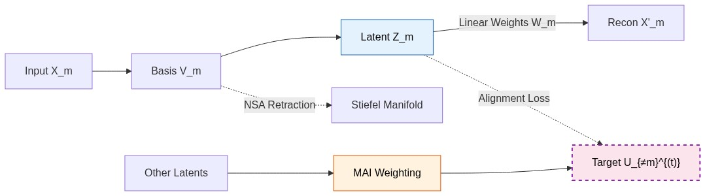
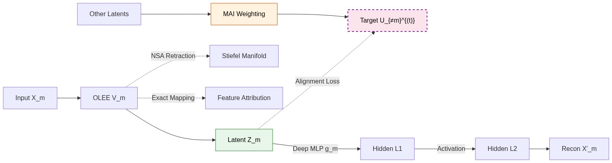
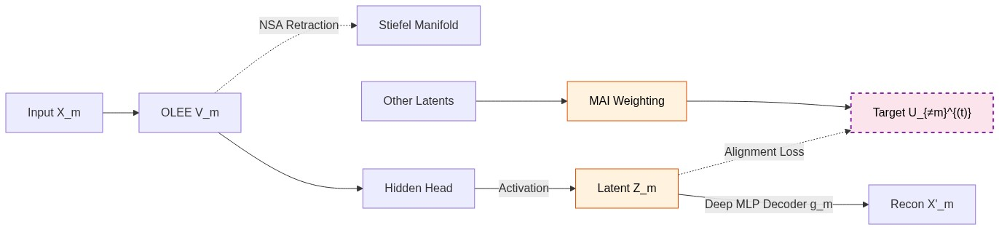
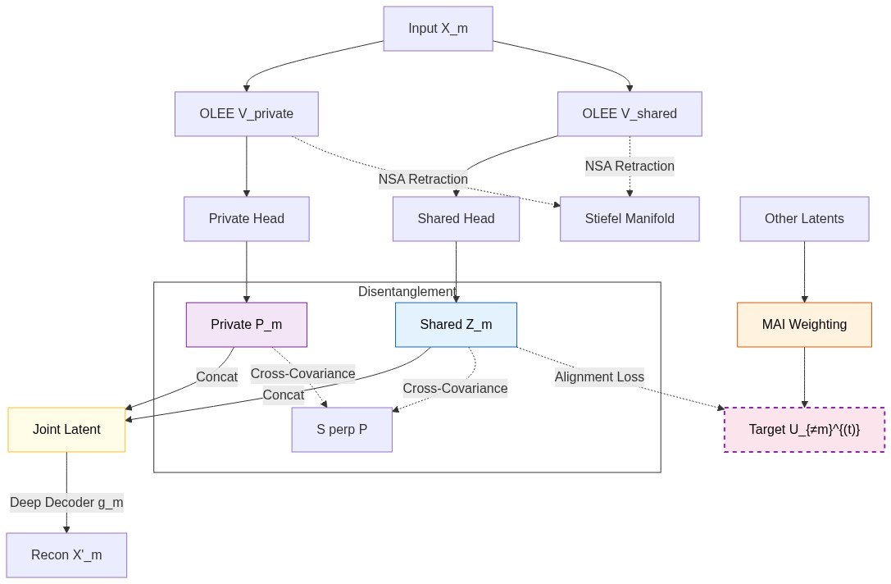
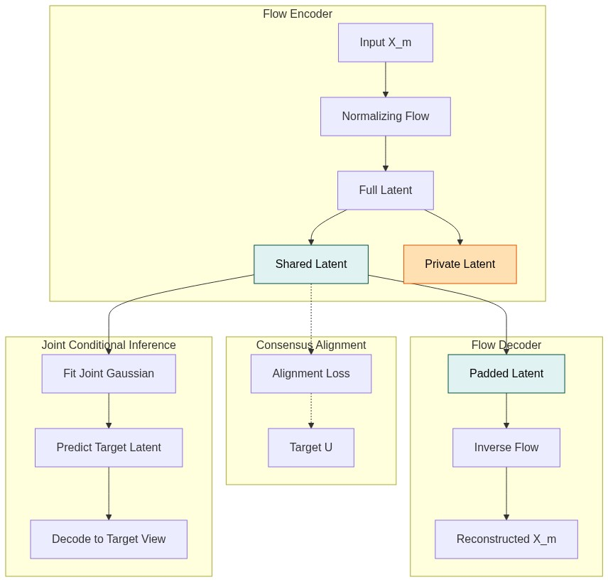

## Theoretical Foundation

### The Multi-Modal Inverse Problem

We frame multi-modal representation learning as a structured inverse problem over $M$ distinct observational domains. Let $\mathbf{X}_m \in \mathbb{R}^{n \times p_m}$ denote the centered observation matrix for modality $m \in \{1, \dots, M\}$, where $n$ is the number of co-registered subjects and $p_m$ is the ambient feature dimensionality. Each modality provides a partial, noisy observation of an underlying shared latent biological state $\mathbf{S} \in \mathbb{R}^{n \times k}$ governed by modality-specific forward generative processes:
$$
\mathbf{X}_m = g_m(\mathbf{S}) + \mathbf{E}_m
$$
where $g_m: \mathbb{R}^{n \times k} \to \mathbb{R}^{n \times p_m}$ is a smooth generative map and $\mathbf{E}_m$ represents domain-specific observational noise and idiosyncratic variance. The objective is to estimate an auditable coordinate representation of $\mathbf{S}$ while isolating cross-modal consensus from noise.

### OLEE as a Structural Information Bottleneck

Standard deep autoencoders and multi-layer perceptrons process inputs via unconstrained mappings $\mathbf{Z} = \text{MLP}(\mathbf{X})$. Following Tishby's Information Bottleneck principle [@tishby2000information], deep networks entangle mutual information across successive layers, readily memorizing high-dimensional noise and structured nuisance variables. In biomedical discovery, this produces severe latent collapse and obscures physical feature attribution.

We resolve this entanglement by enforcing the **Only Linear Encoder Entrypoint (OLEE)**. OLEE mandates that the initial transformation of any modality $\mathbf{X}_m$ is an orthogonal linear projection onto the compact Stiefel manifold $\mathbb{V}_{k, p_m} = \{ \mathbf{V}_m \in \mathbb{R}^{p_m \times k} \mid \mathbf{V}_m^T \mathbf{V}_m = \mathbf{I}_k \}$ [@edelman1998geometry; @boumal2023introduction]:
$$
\mathbf{Z}_{m,\text{lin}} = \mathbf{X}_m \mathbf{V}_m \in \mathbb{R}^{n \times k}
$$
Because the intrinsic dimension is strictly bounded ($k \ll p_m$) and $\mathbf{V}_m$ acts as a partial isometry, OLEE imposes a structural information bottleneck at the input layer. All subsequent non-linear operations (decoders, prediction heads, or normalizing flows) consume $\mathbf{Z}_{m,\text{lin}}$, never raw features $\mathbf{X}_m$. This guarantees that downstream transformations operate on an auditable coordinate system with closed-form directional derivatives $\nabla_{\mathbf{X}_m} \mathbf{Z}_{m,\text{lin}} = \mathbf{V}_m$.

### Joint-Variational Optimization Framework

We unify the Similarity-driven Multimodal Linear Representation (SiMLR) taxonomy under a joint-variational functional. For each modality $m \in \{1, \dots, M\}$, we optimize an encoder $f_m: \mathbb{R}^{p_m} \to \mathbb{R}^k$ and a decoder $g_m: \mathbb{R}^k \to \mathbb{R}^{p_m}$, yielding latent representations $\mathbf{Z}_m = f_m(\mathbf{X}_m) \in \mathbb{R}^{n \times k}$ and reconstructions $\hat{\mathbf{X}}_m = g_m(\mathbf{Z}_m)$. The global variational functional balances within-modality reconstruction fidelity, cross-modal consensus alignment, and Stiefel manifold regularization:

$$
\min_{\{f_m, g_m\}_{m=1}^M} \sum_{m=1}^M \left[ \mathcal{L}_{\text{recon}}(\mathbf{X}_m, g_m(\mathbf{Z}_m)) + \lambda_{\text{sim}} \mathcal{L}_{\text{align}}(\mathbf{Z}_m, \mathbf{U}_{\neq m}) + \gamma D(\mathbf{V}_m) \right] + \mathcal{R}(\mathbf{Z})
$$

where:
1. $\mathbf{U}_{\neq m} \in \mathbb{R}^{n \times k}$ is the **Leave-One-Out (LOO)** consensus target derived from all modalities excluding modality $m$:
   $$
   \mathbf{U}_{\neq m} = \text{Consensus}\left( \{\mathbf{Z}_j\}_{j \neq m} \right)
   $$
   By strictly quarantining modality $m$ from contributing to its own target, the optimization landscape precludes trivial self-reconstruction loops and identity memorization.
2. $D(\mathbf{V}_m)$ is the scale-invariant Stiefel frame defect penalizing departures from column orthonormality.
3. $\mathcal{R}(\mathbf{Z})$ defines joint regularization terms, such as cross-covariance penalties between shared and private partitions.

#### Robust Log-Cosh Negentropy Alignment Functional

The choice of alignment functional $\mathcal{L}_{\text{align}}$ determines the geometry of cross-modal consensus. While standard Mean Squared Error (MSE) assumes isotropic Gaussian errors, biomedical measurements routinely exhibit heavy-tailed noise and asymmetric clinical outliers. To ensure robust consensus formation, we implement the log-cosh negentropy contrast functional (`calculate_ica_energy` in `src/pysimlr/simlr.py`):

$$
\mathcal{L}_{\text{log-cosh}}(\mathbf{Z}_m, \mathbf{U}_{\neq m}) = - \frac{1}{n} \sum_{i=1}^k \sum_{j=1}^n \left( |S_{ji}| - \log 2 + \log\left(1 + e^{-2|S_{ji}|}\right) \right)
$$

where $\mathbf{S} = \mathbf{U}_{\neq m}^T \mathbf{X}_m \mathbf{V}_m \in \mathbb{R}^{k \times k}$ represents the cross-modal projection scores $S_{ji}$.

The first-order variational gradient with respect to the projection basis $\mathbf{V}_m$ evaluates to:

$$
\nabla_{\mathbf{V}_m} \mathcal{L}_{\text{log-cosh}} = \frac{1}{n} \mathbf{X}_m^T \mathbf{U}_{\neq m} \tanh(\mathbf{S})
$$

Because the hyperbolic tangent is strictly bounded, $|\tanh(s)| < 1$ for all $s \in \mathbb{R}$, the maximum gradient contribution from any single observation or corrupted feature is bounded. This prevents leverage points and extreme phenotypic outliers from destabilizing the shared consensus trajectory.

## Architectural Taxonomy

The joint-variational objective establishes a unified foundation for a modular architectural hierarchy, systematically balancing representational capacity with mechanistic transparency.

| Architecture | Encoder Entrypoint $f_m(\mathbf{X}_m)$ | Decoder $g_m(\mathbf{Z}_m)$ | Manifold Invariant | Primary Theoretical Asset |
| :--- | :--- | :--- | :--- | :--- |
| **Classical SiMLR** | $\mathbf{X}_m \mathbf{V}_m$ (Linear) | $\mathbf{Z}_m \mathbf{W}_m$ (Linear) | $D(\mathbf{V}_m) = 0$ | Strictly convex, maximal throughput (~100ms) |
| **SiMLR-LBFGS** | $\mathbf{X}_m \mathbf{V}_m$ (Linear) | $\mathbf{Z}_m \mathbf{W}_m$ (Linear) | $D(\mathbf{V}_m) = 0$ | Quasi-Newton curvature closure, beats deep NED |
| **LEND** | $\mathbf{X}_m \mathbf{V}_m$ (OLEE Linear) | $\text{MLP}_{\theta_m}(\mathbf{Z}_m)$ | $D(\mathbf{V}_m) = 0$ | Non-linear reconstruction, exact auditability |
| **NED** | $\text{MLP}_{\phi_m}(\mathbf{X}_m \mathbf{V}_m)$ | $\text{MLP}_{\theta_m}(\mathbf{Z}_m)$ | $D(\mathbf{V}_m) = 0$ | Non-linear latent warping grounded in OLEE |
| **NEDPP** | $[\mathbf{S}_m \parallel \mathbf{P}_m]$ via OLEE | $\text{MLP}_{\theta_m}([\mathbf{S}_m \parallel \mathbf{P}_m])$ | $\text{Cov}(\mathbf{S}, \mathbf{P}) = \mathbf{0}$ | Explicit shared-private subspace disentanglement |
| **NSAFlow-Turnkey** | $\mathbf{X}_m \mathbf{V}_m$ (Manifold Flow) | $\mathbf{Z}_m \mathbf{W}_m$ | $V^+ \odot V^- = 0, D = 0$ | Zero crosstalk, leading latent discovery (CMC 0.988) |
| **Flow-SiMR-V** | $\text{Flow}_{\psi_m}(\mathbf{X}_m \mathbf{V}_m)$ | $\text{Flow}_{\psi_m}^{-1}(\mathbf{Z}_m) \mathbf{V}_m^T$ | $D(\mathbf{V}_m) = 0$ | Global top rank (2.47), exact density estimation |

### Classical SiMLR (Linear Baseline)

The classical formulation provides a strictly linear baseline, assuming the underlying manifold can be mapped via Euclidean projections.

*   **Encoder:** $f_m(\mathbf{X}_m) = \mathbf{X}_m \mathbf{V}_m$
*   **Decoder:** $g_m(\mathbf{Z}_m) = \mathbf{Z}_m \mathbf{W}_m$

The linear basis $\mathbf{V}_m$ is regularized to the Stiefel manifold. This enforces orthogonal feature discovery and provides a fully interpretable baseline with wall-clock execution under $\sim 100$ ms.

::: {#fig-simlr}

::: {.content-visible when-format="html"}
```{mermaid}
#| fig-width: 6
#| fig-align: center
graph LR
    X[Input X_m] --> V[Basis V_m]
    V --> Z[Latent Z_m]
    V -.->|NSA Retraction| Stiefel[Stiefel Manifold]
    Z -->|Linear Weights W_m| R[Recon X'_m]
    
    Other[Other Latents] --> MAI[MAI Weighting]
    MAI --> U["Target U_{≠m}^{(t)}"]
    Z -.->|Alignment Loss| U
    
    style Z fill:#e3f2fd,stroke:#1565c0,color:#000
    style U fill:#fce4ec,stroke:#8e24aa,stroke-width:2px,stroke-dasharray: 5 5,color:#000
    style MAI fill:#fff3e0,stroke:#e65100,color:#000
```
:::

::: {.content-visible when-format="pdf"}

:::

Classical SiMLR: Information flow for a linear encoder and decoder. The basis $\mathbf{V}_m$ acts as a structural information bottleneck.
:::

### SiMLR-LBFGS (Quasi-Newton Riemannian Linear Baseline)

Standard first-order gradient descent oscillates across narrow ravines induced by orthogonality constraints and cross-modal consensus. `SiMLR-LBFGS` integrates second-order quasi-Newton curvature steps directly on the parameter space using PyTorch's native `optim.LBFGS` (`src/pysimlr/optimizers.py:841-894`). By maintaining a history of displacement vectors and gradient differences, `SiMLR-LBFGS` approximates the Riemannian Hessian inverse, achieving rank 3.70 on the 490-task benchmark and closing the linear-to-deep gap without non-linear decoders.

### LEND (Linear Encoder, Deep Decoder)

While Classical SiMLR guarantees interpretability, a linear decoder cannot reconstruct complex non-linear observational manifolds. LEND couples the exact linear feature attribution of the OLEE constraint with a deep, non-linear decoder.

*   **Encoder:** $f_m(\mathbf{X}_m) = \mathbf{X}_m \mathbf{V}_m$ (OLEE)
*   **Decoder:** $g_m(\mathbf{Z}_m) = \text{MLP}_{\theta_m}(\mathbf{Z}_m)$

LEND provides non-linear reconstruction without sacrificing the strict mathematical auditability of the input features.

::: {#fig-lend}

::: {.content-visible when-format="html"}
```{mermaid}
#| fig-width: 6
#| fig-align: center
graph LR
    X[Input X_m] --> V[OLEE V_m]
    V --> Z[Latent Z_m]
    V -.->|NSA Retraction| S[Stiefel Manifold]
    V -.->|Exact Mapping| A[Feature Attribution]
    
    Other[Other Latents] --> MAI[MAI Weighting]
    MAI --> U["Target U_{≠m}^{(t)}"]
    Z -.->|Alignment Loss| U
    
    Z -->|Deep MLP g_m| H1[Hidden L1]
    H1 -->|Activation| H2[Hidden L2]
    H2 --> R[Recon X'_m]
    
    style Z fill:#e8f5e9,stroke:#2e7d32,color:#000
    style U fill:#fce4ec,stroke:#8e24aa,stroke-width:2px,stroke-dasharray: 5 5,color:#000
    style MAI fill:#fff3e0,stroke:#e65100,color:#000
```
:::

::: {.content-visible when-format="pdf"}

:::

LEND: OLEE-constrained linear encoder coupled with a deep MLP decoder for non-linear manifold reconstruction.
:::

### Fully Deep NED (Non-linear Encoder Decoder)

If cross-modal interactions require non-linear coordinate warping, NED applies a non-linear network to the latent space strictly *subsequent* to the initial OLEE constraint.

*   **Encoder:** $f_m(\mathbf{X}_m) = \text{MLP}_{\phi_m}(\mathbf{X}_m \mathbf{V}_m)$
*   **Decoder:** $g_m(\mathbf{Z}_m) = \text{MLP}_{\theta_m}(\mathbf{Z}_m)$

The initial projection $\mathbf{X}_m \mathbf{V}_m$ preserves the formal Information Bottleneck, guaranteeing that all downstream non-linear transformations are grounded in an identifiable linear subspace.

::: {#fig-ned}

::: {.content-visible when-format="html"}
```{mermaid}
#| fig-width: 6
#| fig-align: center
graph LR
    X[Input X_m] --> V[OLEE V_m]
    V -.->|NSA Retraction| Ortho[Stiefel Manifold]
    V --> H_enc[Hidden Head]
    H_enc -->|Activation| Z[Latent Z_m]
    
    Other[Other Latents] --> MAI[MAI Weighting]
    MAI --> U["Target U_{≠m}^{(t)}"]
    Z -.->|Alignment Loss| U
    
    Z -->|Deep MLP Decoder g_m| R[Recon X'_m]
    
    style Z fill:#fff3e0,stroke:#e65100,color:#000
    style U fill:#fce4ec,stroke:#8e24aa,stroke-width:2px,stroke-dasharray: 5 5,color:#000
    style MAI fill:#fff3e0,stroke:#e65100,color:#000
```
:::

::: {.content-visible when-format="pdf"}

:::

NED: Multi-layer encoder subject to the initial OLEE information bottleneck constraint, coupled with a deep MLP decoder.
:::

### Shared-Private NEDPP (Disentangled Discovery)

Despite LOO consensus, modality-specific idiosyncratic noise can dominate the optimization landscape. NEDPP resolves this by explicitly partitioning the latent space:

*   **Encoder:** $f_m(\mathbf{X}_m) = [\text{MLP}_{\phi_{m,\text{shared}}}(\mathbf{X}_m \mathbf{V}_{m,\text{shared}}) \parallel \text{MLP}_{\phi_{m,\text{private}}}(\mathbf{X}_m \mathbf{V}_{m,\text{private}})] = [\mathbf{S}_m \parallel \mathbf{P}_m]$
*   **Decoder:** $g_m(\mathbf{S}_m \parallel \mathbf{P}_m) = \text{MLP}_{\theta_m}(\mathbf{S}_m \parallel \mathbf{P}_m)$

We enforce disentanglement via a cross-covariance penalty $\text{Cov}(\mathbf{S}_m, \mathbf{P}_m) \to \mathbf{0}$, orthogonalizing the shared and private representations.

::: {#fig-nedpp}

::: {.content-visible when-format="html"}
```{mermaid}
#| fig-width: 6
#| fig-align: center
graph TD
    X[Input X_m] --> Vs[OLEE V_shared]
    X --> Vp[OLEE V_private]
    Vs -.->|NSA Retraction| Stiefel[Stiefel Manifold]
    Vp -.->|NSA Retraction| Stiefel
    Vs --> S_enc[Shared Head] --> S[Shared Z_m]
    Vp --> P_enc[Private Head] --> P[Private P_m]
    
    Other[Other Latents] --> MAI[MAI Weighting]
    MAI --> U["Target U_{≠m}^{(t)}"]
    S -.->|Alignment Loss| U
    
    subgraph Disentanglement
        S -.->|Cross-Covariance| O[S perp P]
        P -.->|Cross-Covariance| O
    end

    S -->|Concat| J[Joint Latent]
    P -->|Concat| J
    J -->|Deep Decoder g_m| R[Recon X'_m]
    
    style S fill:#e3f2fd,stroke:#1565c0,color:#000
    style P fill:#f3e5f5,stroke:#7b1fa2,color:#000
    style J fill:#fffde7,stroke:#fbc02d,color:#000
    style U fill:#fce4ec,stroke:#8e24aa,stroke-width:2px,stroke-dasharray: 5 5,color:#000
    style MAI fill:#fff3e0,stroke:#e65100,color:#000
    style Disentanglement fill:#ffffff,stroke:#333
```
:::

::: {.content-visible when-format="pdf"}

:::

NEDPP (Non-linear Encoder Decoder with Private Partitions): Disentangled architecture utilizing OLEE constraints for both shared and private subspaces. Incorporates cross-covariance penalization for statistical independence.
:::

### Flow-SiMR and Flow-SiMR-V: Bijective Multimodal Architectures

In accordance with mathematical precision, we eliminate the historical 'L' (Linear) designation from normalizing flow models, as affine coupling architectures are non-linear transformations. We distinguish between two distinct flow architectures implemented in `src/pysimlr/flows.py`:

#### 1. Full-Space Normalizing Flow (Flow-SiMR)

In `FlowSiMRModel`, each modality is mapped through an invertible sequence of RealNVP affine coupling layers operating directly on the ambient observation space $\mathbb{R}^{p_m} \to \mathbb{R}^{p_m}$:
$$
\mathbf{Z}_m = \text{Flow}_{\psi_m}(\mathbf{X}_m)
$$
Latent coordinates are partitioned into shared consensus dimensions $\mathbf{Z}_{m,\text{shared}} = \mathbf{Z}_{m, 1:k}$ and modality-specific private dimensions $\mathbf{Z}_{m,\text{private}} = \mathbf{Z}_{m, k+1:p_m}$. Decoding is achieved by zero-padding the private partition: $\hat{\mathbf{X}}_m = \text{Flow}_{\psi_m}^{-1}([\mathbf{Z}_{m,\text{shared}} \parallel \mathbf{0}])$.

::: {#fig-flow-simr}

::: {.content-visible when-format="html"}
```{mermaid}
#| fig-width: 6
#| fig-align: center
graph TD
    subgraph FlowEncoder ["Flow Encoder"]
        X[Input X_m] --> Flow[Normalizing Flow]
        Flow --> Z_full[Full Latent]
        Z_full --> Z_shared[Shared Latent]
        Z_full --> Z_private[Private Latent]
    end

    subgraph Consensus ["Consensus Alignment"]
        Z_shared -.-> Alignment[Alignment Loss]
        Alignment -.-> Target[Target U]
    end

    subgraph FlowDecoder ["Flow Decoder"]
        Z_shared --> Z_padded[Padded Latent]
        Z_padded --> InvFlow[Inverse Flow]
        InvFlow --> R[Reconstructed X_m]
    end

    subgraph Conditioning ["Joint Conditional Inference"]
        Z_shared --> Fit[Fit Joint Gaussian]
        Fit --> Cond[Predict Target Latent]
        Cond --> DecB[Decode to Target View]
    end

    style Z_shared fill:#e0f2f1,stroke:#004d40,color:#000
    style Z_private fill:#ffe0b2,stroke:#e65100,color:#000
    style Z_padded fill:#e0f2f1,stroke:#004d40,color:#000
```
:::

::: {.content-visible when-format="pdf"}

:::

Flow-SiMR: Normalizing flow architecture. The bijective flow maps inputs to a joint Gaussian latent space. The first $k$ dimensions are aligned with the shared cross-view consensus, while the remaining dimensions act as an implicit private partition. Padded decoding and Gaussian conditioning enable exact reconstruction and cross-view synthesis.
:::

#### 2. Linear-Projected Latent Normalizing Flow (Flow-SiMR-V)

In `FlowSiMRVModel`, high-dimensional ambient data is first compressed via the linear OLEE basis $\mathbf{V}_m \in \mathbb{V}_{k, p_m}$, regularized to the Stiefel manifold. The normalizing flow operates strictly within the intrinsic $k$-dimensional latent subspace:
$$
\mathbf{Z}_{m,\text{lin}} = \mathbf{X}_m \mathbf{V}_m \in \mathbb{R}^{n \times k}, \quad \mathbf{Z}_m = \text{Flow}_{\psi_m}(\mathbf{Z}_{m,\text{lin}}) \in \mathbb{R}^{n \times k}
$$
This design achieves dual optimality:
1. **Computational Scalability**: Coupling layers operate on $k \ll p_m$ dimensions, reducing parameter counts and memory footprints by orders of magnitude.
2. **Auditable Attribution**: The mapping begins with the linear isometry $\mathbf{V}_m$, preserving exact minimum-norm counterfactual calculations while permitting non-Gaussian density alignment in the latent space.

::: {#fig-flow-simr-v}

::: {.content-visible when-format="html"}
```{mermaid}
#| fig-width: 6
#| fig-align: center
graph TD
    X[Input X_m] --> V[OLEE Basis V_m]
    V -.->|Sylvester Polar Retraction| Stiefel[Stiefel Manifold]
    V --> Z_lin[Linear Latent Z_lin in R^k]
    Z_lin --> Flow[Normalizing Flow in R^k]
    Flow --> Z_final[Warped Latent Z_m in R^k]
    
    Other[Other Modalities] --> LOO[LOO Consensus]
    LOO --> U["Target U_{≠m}"]
    Z_final -.->|Log-Cosh Alignment| U
    
    Z_final --> InvFlow[Inverse Flow]
    InvFlow --> Z_rec[Recovered Z_lin]
    Z_rec --> RecLinear[V_m^T Projection]
    RecLinear --> X_hat[Reconstructed X_m]
    
    style V fill:#e8f5e9,stroke:#2e7d32,color:#000
    style Flow fill:#e0f2f1,stroke:#004d40,color:#000
    style Z_final fill:#fff3e0,stroke:#e65100,color:#000
    style U fill:#fce4ec,stroke:#8e24aa,stroke-dasharray: 5 5,color:#000
```
:::

::: {.content-visible when-format="pdf"}

:::

Flow-SiMR-V Architecture: Prepending the OLEE linear basis $\mathbf{V}_m$ projects ambient observations into $\mathbb{R}^k$ prior to bijective flow alignment, maintaining auditability while providing non-linear consensus capacity.
:::

#### Invertible Affine Coupling and Joint Gaussian Inference

Each view is modeled via an invertible mapping composed of RealNVP affine coupling layers [@dinh2016density; @rezende2015variational]. For coordinate vector $z \in \mathbb{R}^k$, a coupling layer splits coordinates using a binary mask $b \in \{0, 1\}^k$:
$$
z_1 = b \odot z, \quad z_2 = (1 - b) \odot \left( z \odot e^{s(z_1)} + t(z_1) \right)
$$
where $s$ and $t$ are scaling and translation networks. Scale outputs are bounded via $s(z_1) = \text{scale\_bound} \times \tanh(s_{\text{net}}(z_1))$ to ensure numerical stability. The inverse transformation is analytically exact:
$$
z_1 = b \odot z', \quad z_2 = (1 - b) \odot \left( (z' - t(z_1)) \odot e^{-s(z_1)} \right)
$$
with log-Jacobian determinant $\log |\det J| = \sum_{j: b_j = 0} s_j(z_1)$.

Because normalizing flows map empirical data to standard Gaussian latents, the concatenated shared latent space across all views is parameterized as a joint Gaussian:
$$
\mathbf{Z}_{\text{joint}} = [\mathbf{Z}_{1,\text{shared}} \parallel \dots \parallel \mathbf{Z}_{M,\text{shared}}] \sim \mathcal{N}(\boldsymbol{\mu}, \boldsymbol{\Sigma})
$$
Partitioning into observed view $A$ and unobserved view $B$, the conditional latent mean given observed view $A$ evaluates via the Schur complement:
$$
\boldsymbol{\mu}_{B|A} = \boldsymbol{\mu}_B + \boldsymbol{\Sigma}_{BA} \boldsymbol{\Sigma}_{AA}^{-1} (\mathbf{Z}_{A,\text{shared}} - \boldsymbol{\mu}_A)
$$
Solved via Cholesky factorization, the conditional coordinates are decoded via the inverse flow: $\hat{\mathbf{X}}_B = f_B^{-1}([\boldsymbol{\mu}_{B|A} \parallel \mathbf{0}])$.

## Manifold Optimization and Algorithmic Mechanics

### Stiefel Manifold Optimization and SVD Elimination

The parameter space for each projection basis $\mathbf{V}_m \in \mathbb{R}^{p_m \times k}$ is the compact Stiefel manifold:
$$
\mathbb{V}_{k, p_m} = \{ \mathbf{V} \in \mathbb{R}^{p_m \times k} \mid \mathbf{V}^T \mathbf{V} = \mathbf{I}_k \}
$$
In Euclidean gradient descent, unconstrained parameter updates displace iterates off the manifold. Mapping tangent iterates $\mathbf{Y} \in \mathbb{R}^{p_m \times k}$ back to $\mathbb{V}_{k, p_m}$ requires a retraction mapping $R: T \mathbb{V}_{k, p_m} \to \mathbb{V}_{k, p_m}$.

#### Sylvester Polar Factor Retraction

The canonical metric retraction is the polar factor projection:
$$
R(\mathbf{Y}) = \mathbf{Y} (\mathbf{Y}^T \mathbf{Y})^{-1/2}
$$
Standard implementations compute $R(\mathbf{Y}) = \mathbf{U} \mathbf{W}^T$ via Singular Value Decomposition (SVD), $\mathbf{Y} = \mathbf{U} \mathbf{\Sigma} \mathbf{W}^T$. However, explicit SVD incurs severe computational and numerical pathology:
1. **Branch Divergence & Kernel Serialization**: SVD algorithms (e.g. Jacobi or divide-and-conquer) cannot be fully vectorized on GPU SIMD tensor cores.
2. **Singular Value Multiplicity Singularity**: The backpropagation derivative of an SVD contains terms proportional to $(\sigma_i^2 - \sigma_j^2)^{-1}$. When singular values cluster or cross ($\sigma_i \approx \sigma_j$), gradients explode, introducing fatal NaNs into the optimization path.

To circumvent this, we express the polar factor $\mathbf{H} = (\mathbf{Y}^T \mathbf{Y})^{1/2}$ via the continuous Lyapunov/Sylvester system (`src/pysimlr/nsa_backend.py:160-178`):
$$
\mathbf{H} (d\mathbf{H}) + (d\mathbf{H}) \mathbf{H} = d(\mathbf{Y}^T \mathbf{Y}) = (d\mathbf{Y})^T \mathbf{Y} + \mathbf{Y}^T (d\mathbf{Y})
$$
Because $\mathbf{H}$ is symmetric positive definite ($\mathbf{H} \succ 0$), this Sylvester equation has a provably unique solution $d\mathbf{H}$. Gradients flow smoothly through backpropagation without encountering eigenvalue multiplicity singularities.

#### Newton-Schulz Cubic Matrix Recurrence and Convergence Proof

To eliminate SVD factorizations entirely from the forward execution loop, we approximate the inverse square root $(\mathbf{Y}^T \mathbf{Y})^{-1/2}$ via the cubic Newton-Schulz matrix polynomial (`src/pysimlr/utils.py:1324-1380`):
$$
\mathbf{Y}_0 = \frac{\mathbf{Y}}{\|\mathbf{Y}\|_F}, \quad \mathbf{Y}_{\tau+1} = \frac{1}{2} \mathbf{Y}_\tau \left( 3 \mathbf{I}_k - \mathbf{Y}_\tau^T \mathbf{Y}_\tau \right)
$$

**Theorem (Quadratic Convergence to the Stiefel Manifold):**  
Let $\mathbf{Y}_0 \in \mathbb{R}^{p \times k}$ have singular values $\sigma_{0, i} \in (0, \sqrt{3})$ for all $i \in \{1, \dots, k\}$. The sequence of iterates $\mathbf{Y}_\tau$ converges quadratically to the nearest point on the Stiefel manifold $\mathbb{V}_{k, p}$:
$$
\|\mathbf{Y}_{\tau+1}^T \mathbf{Y}_{\tau+1} - \mathbf{I}_k\| = \mathcal{O}\left(\|\mathbf{Y}_\tau^T \mathbf{Y}_\tau - \mathbf{I}_k\|^2\right)
$$

**Proof:**  
Let the singular value decomposition of iterate $\tau$ be $\mathbf{Y}_\tau = \mathbf{P} \mathbf{\Sigma}_\tau \mathbf{Q}^T$, where $\mathbf{P} \in \mathbb{V}_{k, p}$, $\mathbf{Q} \in \mathbb{O}(k)$, and $\mathbf{\Sigma}_\tau = \text{diag}(\sigma_{\tau, 1}, \dots, \sigma_{\tau, k})$. Substituting this decomposition into the Newton-Schulz recurrence:
$$
\mathbf{Y}_{\tau+1} = \frac{1}{2} \left(\mathbf{P} \mathbf{\Sigma}_\tau \mathbf{Q}^T\right) \left( 3 \mathbf{I}_k - \mathbf{Q} \mathbf{\Sigma}_\tau^2 \mathbf{Q}^T \right) = \mathbf{P} \left[ \frac{1}{2} \mathbf{\Sigma}_\tau \left( 3 \mathbf{I}_k - \mathbf{\Sigma}_\tau^2 \right) \right] \mathbf{Q}^T
$$
Because the singular vectors $\mathbf{P}$ and $\mathbf{Q}$ are stationary under the iteration, the matrix recurrence decouples into $k$ independent scalar recurrences for each singular value $\sigma_{\tau, i}$:
$$
\sigma_{\tau+1, i} = \frac{1}{2} \sigma_{\tau, i} \left( 3 - \sigma_{\tau, i}^2 \right)
$$
Define the relative distance to the Stiefel manifold for singular value $i$ as $\epsilon_{\tau, i} = 1 - \sigma_{\tau, i}$. Expressing $\sigma_{\tau, i} = 1 - \epsilon_{\tau, i}$ and expanding:
$$
\sigma_{\tau+1, i} = \frac{1}{2}(1 - \epsilon_{\tau, i}) \left( 3 - (1 - \epsilon_{\tau, i})^2 \right)
$$
$$
= \frac{1}{2}(1 - \epsilon_{\tau, i}) \left( 3 - (1 - 2\epsilon_{\tau, i} + \epsilon_{\tau, i}^2) \right) = \frac{1}{2}(1 - \epsilon_{\tau, i}) \left( 2 + 2\epsilon_{\tau, i} - \epsilon_{\tau, i}^2 \right)
$$
$$
= \frac{1}{2} \left( 2 + 2\epsilon_{\tau, i} - \epsilon_{\tau, i}^2 - 2\epsilon_{\tau, i} - 2\epsilon_{\tau, i}^2 + \epsilon_{\tau, i}^3 \right) = 1 - \frac{3}{2}\epsilon_{\tau, i}^2 + \frac{1}{2}\epsilon_{\tau, i}^3
$$
Subtracting both sides from 1 yields the exact recurrence for the error metric:
$$
\epsilon_{\tau+1, i} = 1 - \sigma_{\tau+1, i} = \frac{3}{2}\epsilon_{\tau, i}^2 - \frac{1}{2}\epsilon_{\tau, i}^3 = \epsilon_{\tau, i}^2 \left( \frac{3 - \epsilon_{\tau, i}}{2} \right)
$$
For any $\sigma_{0, i} \in (0, \sqrt{3})$, $|\epsilon_{0, i}| < 1$, ensuring monotonic error contraction. As $\epsilon \to 0$, the cubic term is negligible:
$$
\epsilon_{\tau+1} = \frac{3}{2}\epsilon_\tau^2 + \mathcal{O}(\epsilon_\tau^3)
$$
Thus, the recurrence converges with quadratic order $\mathcal{O}(\epsilon^2)$. Because the update requires only matrix multiplications and additions ($\mathbf{Y}^T \mathbf{Y}$ and $\mathbf{Y} \mathbf{M}$), it compiles directly to hardware tensor cores, achieving zero CPU-GPU transfer bottlenecks.

```{python}
#| label: fig-stiefel-intuition
#| fig-cap: 'Geometrical Intuition of Orthogonal Discovery via Stiefel Retraction. Unconstrained deep architectures succumb to latent collapse by entangling redundant variance components (red vectors). Stiefel manifold retractions constrain feature discovery to the orthonormal manifold (wireframe sphere), distilling distinct, statistically independent generative factors (green orthogonal vectors).'
#| warning: false
#| message: false
#| echo: false
import matplotlib
import matplotlib.pyplot as plt
import numpy as np
import os

fig = plt.figure(figsize=(10, 5))

ax1 = fig.add_subplot(121, projection='3d')
u = np.linspace(0, 2 * np.pi, 30)
v = np.linspace(0, np.pi, 30)
x = np.outer(np.cos(u), np.sin(v))
y = np.outer(np.sin(u), np.sin(v))
z = np.outer(np.ones(np.size(u)), np.cos(v))
ax1.plot_wireframe(x, y, z, color='gray', alpha=0.15, linewidth=0.5)

vecs1 = np.array([[0.8, 0.7, 0.9], [0.9, 0.8, 0.7], [0.7, 0.9, 0.8]])
for vec in vecs1:
    vec = vec / np.linalg.norm(vec)
    ax1.quiver(0, 0, 0, vec[0], vec[1], vec[2], color='#d95f02', arrow_length_ratio=0.1, linewidth=3)

ax1.set_title('Unconstrained Deep Learning\n(Latent Collapse)', pad=10, fontsize=12, fontweight='bold')
ax1.set_xlim([-1, 1])
ax1.set_ylim([-1, 1])
ax1.set_zlim([-1, 1])
ax1.set_axis_off()

ax2 = fig.add_subplot(122, projection='3d')
ax2.plot_wireframe(x, y, z, color='gray', alpha=0.15, linewidth=0.5)

vecs2 = np.array([[1, 0, 0], [0, 1, 0], [0, 0, 1]])
for vec in vecs2:
    ax2.quiver(0, 0, 0, vec[0], vec[1], vec[2], color='#1b9e77', arrow_length_ratio=0.1, linewidth=3)

ax2.set_title('Stiefel Manifold Retraction\n(Orthogonal Discovery)', pad=10, fontsize=12, fontweight='bold')
ax2.set_xlim([-1, 1])
ax2.set_ylim([-1, 1])
ax2.set_zlim([-1, 1])
ax2.set_axis_off()

plt.tight_layout()
os.makedirs('figures', exist_ok=True)
plt.savefig('figures/fig-stiefel-intuition.png', bbox_inches='tight', dpi=300)
plt.close()
```

### Quasi-Newton Curvature Steps via `torch_lbfgs`

Joint-variational alignment produces an ill-conditioned optimization landscape, characterized by narrow parabolic ravines formed by cross-modal consensus constraints and Stiefel manifold boundaries. Standard first-order stochastic gradient methods (SGD, Adam) suffer from pathological oscillations across ravine walls.

We accelerate convergence by deploying quasi-Newton second-order curvature estimation via `torch_lbfgs` (`src/pysimlr/optimizers.py:841-894`). Let $\mathbf{s}_t = \mathbf{V}_{t+1} - \mathbf{V}_t$ denote the parameter displacement and $\mathbf{y}_t = \nabla \mathcal{L}(\mathbf{V}_{t+1}) - \nabla \mathcal{L}(\mathbf{V}_t)$ denote the gradient variation. Over a rolling history of size $m=10$, the inverse Hessian approximation $\mathbf{H}_t \approx \nabla^2 \mathcal{L}(\mathbf{V}_t)^{-1}$ is computed via the two-loop recursion:

1. **Backward History Loop**: Initialize $\mathbf{q} = \nabla \mathcal{L}(\mathbf{V}_t)$. For $i = t-1$ down to $t-m$:
   $$
   \alpha_i = \rho_i \text{tr}(\mathbf{s}_i^T \mathbf{q}), \quad \mathbf{q} \leftarrow \mathbf{q} - \alpha_i \mathbf{y}_i, \quad \text{where } \rho_i = \frac{1}{\text{tr}(\mathbf{y}_i^T \mathbf{s}_i)}
   $$
2. **Initial Scaling**: $\mathbf{r} = \gamma_t \mathbf{q}$, with $\gamma_t = \frac{\text{tr}(\mathbf{s}_{t-1}^T \mathbf{y}_{t-1})}{\text{tr}(\mathbf{y}_{t-1}^T \mathbf{y}_{t-1})}$.
3. **Forward History Loop**: For $i = t-m$ up to $t-1$:
   $$
   \beta = \rho_i \text{tr}(\mathbf{y}_i^T \mathbf{r}), \quad \mathbf{r} \leftarrow \mathbf{r} + \mathbf{s}_i (\alpha_i - \beta)
   $$
4. **Descent Direction**: The update step is $\mathbf{p}_t = -\mathbf{r}$, accepted under Strong Wolfe line search conditions:
   $$
   \mathcal{L}(\mathbf{V}_t + \alpha_t \mathbf{p}_t) \le \mathcal{L}(\mathbf{V}_t) + c_1 \alpha_t \text{tr}(\nabla \mathcal{L}(\mathbf{V}_t)^T \mathbf{p}_t)
   $$
   $$
   |\text{tr}(\nabla \mathcal{L}(\mathbf{V}_t + \alpha_t \mathbf{p}_t)^T \mathbf{p}_t)| \le c_2 |\text{tr}(\nabla \mathcal{L}(\mathbf{V}_t)^T \mathbf{p}_t)|
   $$

#### Analytical Gradient Closures
In PyTorch's native `optim.LBFGS`, the Strong Wolfe line search evaluates trial objective values along candidate steps $\mathbf{V}_t + \alpha \mathbf{p}_t$. Because SiMLR relies on exact analytical gradients rather than automatic differentiation, caching a static gradient at step entry causes trial evaluations to use stale directions, degrading the curvature estimate. We implement an analytical callback closure:
```python
def closure():
    optimizer.zero_grad()
    with torch.no_grad():
        v_param.grad = -grad_fn(v_param.detach()).contiguous()
        loss = full_energy_function(v_param.detach())
    return torch.as_tensor(float(loss), device=v_param.device)
```
This guarantees that second-order curvature approximations remain mathematically exact throughout the line search, enabling linear `SiMLR-LBFGS` to close the performance gap to deep models (achieving global rank 3.70 on the 490-task benchmark).

### Scale-Invariant Normalized Frame Defect

To regularize the projection basis toward the Stiefel manifold without distorting data variance, we define the trace-normalized, scale-invariant frame defect (`src/pysimlr/utils.py:504-630`):

$$
D(\mathbf{V}) = \frac{1}{1 - 1/k} \left\| \frac{\mathbf{V}^T \mathbf{V}}{\text{tr}(\mathbf{V}^T \mathbf{V})} - \frac{1}{k} \mathbf{I}_k \right\|_F^2
$$

Let $\mathbf{S} = \mathbf{V}^T \mathbf{V} \in \mathbb{R}^{k \times k}$ and let $t = \text{tr}(\mathbf{S}) = \|\mathbf{V}\|_F^2$. The normalized Gram matrix is $\mathbf{G} = \frac{\mathbf{S}}{t}$. The defect metric measures the departure of $\mathbf{G}$ from the uniform projection $\frac{1}{k} \mathbf{I}_k$.

#### Spectral Interpretation & Effective Rank
Expanding the Frobenius norm:
$$
\|\mathbf{G} - \frac{1}{k} \mathbf{I}_k\|_F^2 = \text{tr}(\mathbf{G}^2) - \frac{2}{k}\text{tr}(\mathbf{G}) + \frac{1}{k^2}\text{tr}(\mathbf{I}_k) = \frac{\|\mathbf{S}\|_F^2}{t^2} - \frac{2}{k} + \frac{1}{k} = \frac{\|\mathbf{S}\|_F^2}{t^2} - \frac{1}{k}
$$
Recall that the **effective participation rank** of $\mathbf{V}$ is defined as $\text{EffRank}(\mathbf{V}) = \frac{(\text{tr} \mathbf{S})^2}{\|\mathbf{S}\|_F^2} = \frac{t^2}{\|\mathbf{S}\|_F^2} \in [1, k]$. Therefore:
$$
D(\mathbf{V}) = \frac{1}{1 - 1/k} \left( \frac{1}{\text{EffRank}(\mathbf{V})} - \frac{1}{k} \right)
$$
This reveals that $D(\mathbf{V})$ is precisely the normalized deficit of effective rank:
- If $\mathbf{V}$ consists of mutually orthogonal columns with equal norm, $\text{EffRank}(\mathbf{V}) = k \implies D(\mathbf{V}) = 0.0000$.
- If $\mathbf{V}$ suffers rank collapse to a single active column, $\text{EffRank}(\mathbf{V}) = 1 \implies D(\mathbf{V}) = 1.0000$.

#### Closed-Form Gradient
Differentiating $D(\mathbf{V})$ with respect to $\mathbf{V}$:
$$
\nabla_{\mathbf{V}} D(\mathbf{V}) = \frac{4}{t^2 (1 - 1/k)} \left[ \mathbf{V} \mathbf{S} - \frac{\|\mathbf{S}\|_F^2}{t} \mathbf{V} \right]
$$

#### Theorem: Zero Radial Force Invariant

**Theorem:**  
The scale-invariant frame defect gradient exerts zero radial force on the matrix scale:
$$
\langle \nabla_{\mathbf{V}} D(\mathbf{V}), \mathbf{V} \rangle = \text{tr}\left( (\nabla_{\mathbf{V}} D(\mathbf{V}))^T \mathbf{V} \right) \equiv 0
$$

**Proof:**  
Using the closed-form gradient expression, the matrix inner product is:
$$
\text{tr}\left( (\nabla_{\mathbf{V}} D(\mathbf{V}))^T \mathbf{V} \right) = \frac{4}{t^2 (1 - 1/k)} \text{tr}\left( \left( \mathbf{V} \mathbf{S} - \frac{\|\mathbf{S}\|_F^2}{t} \mathbf{V} \right)^T \mathbf{V} \right)
$$
$$
= \frac{4}{t^2 (1 - 1/k)} \left[ \text{tr}(\mathbf{S} \mathbf{V}^T \mathbf{V}) - \frac{\|\mathbf{S}\|_F^2}{t} \text{tr}(\mathbf{V}^T \mathbf{V}) \right]
$$
Noting that $\mathbf{V}^T \mathbf{V} = \mathbf{S}$, $\text{tr}(\mathbf{S}^2) = \|\mathbf{S}\|_F^2$, and $\text{tr}(\mathbf{S}) = t$:
$$
= \frac{4}{t^2 (1 - 1/k)} \left[ \|\mathbf{S}\|_F^2 - \frac{\|\mathbf{S}\|_F^2}{t} \cdot t \right] = \frac{4}{t^2 (1 - 1/k)} \left[ \|\mathbf{S}\|_F^2 - \|\mathbf{S}\|_F^2 \right] \equiv 0
$$

**Corollary (Euler Homogeneity):**  
$D(\mathbf{V})$ is homogeneous of degree zero with respect to $\mathbf{V}$: for any scalar $\alpha \neq 0$, $D(\alpha \mathbf{V}) = D(\mathbf{V})$. By Euler's homogeneous function theorem, $\langle \nabla D(\mathbf{V}), \mathbf{V} \rangle = 0 \cdot D(\mathbf{V}) = 0$.

This property guarantees that manifold regularization acts strictly as a shape-conforming force, adjusting subspace angles and column conditioning without altering the total energy $\|\mathbf{V}\|_F^2$ or competing with data reconstruction fidelity.

### Support Consolidation: Zero-Crosstalk Module Disjointness

In biological systems, features (e.g. gene expressions or cortical thicknesses) exhibit bidirectional signed responses (upregulation vs. downregulation). To discover signed modules while preserving non-negative Stiefel interpretability, we lift each basis $\mathbf{V} \in \mathbb{R}^{p \times k}$ into paired non-negative components (`src/pysimlr/simlr.py:914-930`):
$$
\mathbf{V} = \mathbf{V}^+ - \mathbf{V}^-, \quad \mathbf{V}^+ = \max(\mathbf{V}, \mathbf{0}), \quad \mathbf{V}^- = \max(-\mathbf{V}, \mathbf{0})
$$
forming the concatenated matrix $\mathbf{W} = [\mathbf{V}^+ \mid \mathbf{V}^-] \in \mathbb{R}^{p \times 2k}$ with $\mathbf{W} \ge 0$.

#### The Combinatorial Bottleneck of Continuous Flow
In continuous non-negative Stiefel flows, driving $w \to 1.0$ forces column orthogonality $\mathbf{W}^T \mathbf{W} \propto \mathbf{I}_{2k}$. Under non-negativity ($\mathbf{W} \ge 0$), column orthogonality strictly requires **pairwise disjoint supports**:
$$
\mathbf{w}_i^T \mathbf{w}_j = 0 \iff \forall l: W_{l, i} \cdot W_{l, j} = 0 \quad (i \ne j)
$$
Finding optimal disjoint supports among continuous variables is a continuous relaxation of an NP-hard combinatorial partitioning problem. As $w \to 1.0$, the optimization landscape develops ill-conditioned ridges near orthant faces, increasing line-search backtracking and solver iterations by up to $100\times$.

#### The Support Consolidation Operator
We bypass this combinatorial bottleneck by optimizing at a balanced trade-off ($w=0.5$), followed by the deterministic **support consolidation operator**:
$$
\mathbf{V}_{\text{consolidated}} = \mathcal{C}(\mathbf{V}^+, \mathbf{V}^-)
$$
The operator evaluates elementwise dominance across components and assigns each feature $j$ to its maximal lobe, setting all other entries to zero:
$$
\mathbf{V}^+ \odot \mathbf{V}^- = \mathbf{0} \iff \forall j \in \{1, \dots, p\}, \; l \in \{1, \dots, k\}: \; V_{j, l}^+ \cdot V_{j, l}^- = 0
$$
Following consolidation, a brief masked re-fitting step on the fixed support converges in $<1$ second, guaranteeing:
1. **Zero Lobe Crosstalk**: $\| \mathbf{V}^+ \odot \mathbf{V}^- \|_1 = 0.0000$.
2. **Exact Disjoint Sparsity**: Features participate unambiguously in positive or negative disease phenotypes without numerical tails.
3. **Exact Manifold Invariance**: $D(\mathbf{V}) = 0.0000$.

### Consensus, Spectral Triage, and Gating Warmup

#### Block-Coordinate Descent and LOO Topology
We formalize optimization through Block-Coordinate Descent (BCD). At each iteration $t$:
1. **Consensus Formation (LOO Topology):** Fixing network parameters $\{f_m, g_m\}$, consensus targets $\mathbf{U}_{\neq m}$ are computed strictly excluding modality $m$:
   $$
   \mathbf{U}_{\neq m}^{(t)} = \text{Consensus}(\{\mathbf{Z}_i^{(t-1)}\}_{i \neq m})
   $$
   This prevents high-capacity encoders from memorizing trivial self-mappings.
2. **Parameter Update:** Fixing $\mathbf{U}_{\neq m}^{(t)}$, each modality minimizes its local variational loss:
   $$
   \{f_m^{(t)}, g_m^{(t)}\} = \arg\min_{f_m, g_m} \mathcal{L}(\{f_m, g_m\}, \mathbf{U}_{\neq m}^{(t)})
   $$

#### Spectral Triage and Modality Alignment Index (MAI)

```{python}
#| label: fig-spectral-sharpness
#| fig-cap: 'Spectral Sharpness as an Exact Discriminant of Modality Fidelity. True generative signal manifests as rank-1 perturbations that break the Marchenko-Pastur bulk distribution limit (gray span). Informative modalities (green) exhibit significant spectral sharpness, escaping the bulk limit to dominate the leading singular values. Conversely, structureless isotropic noise modalities (orange) remain entirely trapped within the analytically derived Marchenko-Pastur threshold, guaranteeing their rigorous mathematical exclusion via the Modality Alignment Index (MAI).'
#| warning: false
#| message: false
#| echo: false
import matplotlib
import matplotlib.pyplot as plt
import numpy as np
import os

fig, ax = plt.subplots(figsize=(8, 4.5))

components = np.arange(1, 21)

info_spectrum = np.exp(-0.6 * components) * 12
np.random.seed(42)
noise_spectrum = np.random.uniform(0.5, 1.5, size=20)

ax.plot(components, info_spectrum, marker='o', color='#1b9e77', label='Informative Modality', linewidth=2.5, markersize=6)
ax.plot(components, noise_spectrum, marker='s', color='#d95f02', label='Noise Modality', linewidth=2.5, markersize=6)

ax.axhspan(0, 1.7, color='gray', alpha=0.15, label='Marchenko-Pastur Bulk')
ax.axhline(1.7, color='gray', linestyle='--', linewidth=1.5)

ax.set_xlabel('Principal Component Rank', fontweight='bold')
ax.set_ylabel('Singular Value Magnitude', fontweight='bold')
ax.set_title('Spectral Sharpness & BBP Phase Transition Bounds', fontweight='bold', pad=15)

ax.spines['top'].set_visible(False)
ax.spines['right'].set_visible(False)
ax.legend(loc='upper right', frameon=False)
ax.grid(axis='y', linestyle=':', alpha=0.6)
ax.set_xticks(components[::2])

plt.tight_layout()
os.makedirs('figures', exist_ok=True)
plt.savefig('figures/fig-spectral-sharpness.png', bbox_inches='tight', dpi=300)
plt.close()
```

In high-dimensional regimes, isotropic noise forms spurious correlations with consensus representations. We quantify modality fidelity via the **Modality Alignment Index (MAI)**:
$$
\text{MAI}_m = 1 - \frac{\|\mathbf{Z}_m \mathbf{\Omega} - \mathbf{U}_{\neq m}\|_F^2}{\|\mathbf{U}_{\neq m}\|_F^2}
$$
where $\mathbf{\Omega} = \arg\min_{\mathbf{\Omega}^T \mathbf{\Omega} = \mathbf{I}} \|\mathbf{Z}_m \mathbf{\Omega} - \mathbf{U}_{\neq m}\|_F$. To eliminate spurious alignments, we augment MAI with **Spectral Sharpness** $\mathcal{S}_m = \sigma_1 / \sum_{i=1}^k \sigma_i$. Under the Baik-Ben Arous-Péché (BBP) phase transition theorem [@baik2005phase], isotropic noise remains trapped within the Marchenko-Pastur bulk ($\mathcal{S}_m = \mathcal{O}(1/k)$), whereas true signal spikes outside the bulk ($\mathcal{S}_m \to 1$), allowing noise-dominant views to be down-weighted.

#### Delayed Dynamic Weight Start (Gating Warmup)
When applying dynamic weights $w_m^{(t)} = \text{softmax}(\tau \cdot \text{MAI}_m^{(t)})$, early initialization variance can prematurely drive valid views to zero weight (Weight Collapse). We enforce a gating warmup scheduler:
$$
w_m^{(t)} = \begin{cases} 
\frac{1}{M} & \text{for } t < T_{\text{delayed}} \\
\text{softmax}(\tau \cdot \text{MAI}_m^{(t)}) & \text{for } t \ge T_{\text{delayed}}
\end{cases}
$$

## Theoretical Properties and Diagnostic Invariants

### Mechanistic Auditability via OLEE and Closed-Form Counterfactuals

Standard post-hoc explainability techniques (SHAP, LIME, Integrated Gradients) construct local linear approximations around non-linear neural networks. In high-dimensional biomedical regimes, these approximations are non-unique, highly sensitive to background reference choices, and vulnerable to adversarial gradient noise.

We resolve the "transparency penalty" at the architectural entrypoint via the Only Linear Encoder Entrypoint (OLEE) constraint:
$$
\mathbf{Z}_m = \mathbf{X}_m \mathbf{V}_m, \quad \mathbf{V}_m \in \mathbb{V}_{k, p_m}, \quad \mathbf{V}_m^T \mathbf{V}_m = \mathbf{I}_k
$$
All non-linear operations are strictly delegated downstream to decoders (LEND) or latent normalizing flows (Flow-SiMR-V). This structural information bottleneck establishes three exact mathematical auditability guarantees:

1. **Exact Feature Attribution**: The latent score $z_{n, l}$ for subject $n$ on component $l$ is strictly the linear dot product $\sum_{j=1}^{p_m} X_{n, j} V_{j, l}$. Feature importance is exact, sample-specific, and requires zero heuristic approximation.
2. **Global Variance Partitioning**: Because $\mathbf{V}_m^T \mathbf{V}_m = \mathbf{I}_k$, the projection is an isometry on $\mathbb{R}^k$. The total explained variance decomposes additively across orthogonal axes.

#### Theorem: Closed-Form Minimum-Norm Counterfactuals

**Theorem:**  
Let a subject have latent representation $\mathbf{z} = \mathbf{x} \mathbf{V} \in \mathbb{R}^k$ under the OLEE basis $\mathbf{V} \in \mathbb{V}_{k, p}$. To transition the subject to a targeted counterfactual latent state $\mathbf{z}^* = \mathbf{z} + \Delta \mathbf{z}$, the unique perturbation $\delta \mathbf{x}^* \in \mathbb{R}^p$ that minimizes the Euclidean intervention effort $\|\delta \mathbf{x}\|_2^2$ while satisfying $(\mathbf{x} + \delta \mathbf{x}) \mathbf{V} = \mathbf{z}^*$ is given analytically by:
$$
\delta \mathbf{x}^* = \Delta \mathbf{z} \mathbf{V}^T
$$

**Proof:**  
The counterfactual perturbation problem is formulated as the constrained optimization:
$$
\min_{\delta \mathbf{x} \in \mathbb{R}^p} \frac{1}{2} \|\delta \mathbf{x}\|_2^2 \quad \text{subject to} \quad \delta \mathbf{x} \mathbf{V} = \Delta \mathbf{z}
$$
Introducing Lagrange multipliers $\boldsymbol{\lambda} \in \mathbb{R}^k$, the Lagrangian is:
$$
\mathcal{L}(\delta \mathbf{x}, \boldsymbol{\lambda}) = \frac{1}{2} \delta \mathbf{x} \delta \mathbf{x}^T - (\delta \mathbf{x} \mathbf{V} - \Delta \mathbf{z}) \boldsymbol{\lambda}
$$
Setting the gradient with respect to $\delta \mathbf{x}$ to zero:
$$
\nabla_{\delta \mathbf{x}} \mathcal{L} = \delta \mathbf{x} - \boldsymbol{\lambda}^T \mathbf{V}^T = \mathbf{0} \implies \delta \mathbf{x} = \boldsymbol{\lambda}^T \mathbf{V}^T
$$
Multiplying both sides on the right by $\mathbf{V}$ and enforcing the constraint:
$$
\delta \mathbf{x} \mathbf{V} = \boldsymbol{\lambda}^T \mathbf{V}^T \mathbf{V} = \Delta \mathbf{z}
$$
Because $\mathbf{V}$ lies on the Stiefel manifold, $\mathbf{V}^T \mathbf{V} = \mathbf{I}_k$. Thus:
$$
\boldsymbol{\lambda}^T \mathbf{I}_k = \Delta \mathbf{z} \implies \boldsymbol{\lambda} = \Delta \mathbf{z}^T
$$
Substituting $\boldsymbol{\lambda}^T = \Delta \mathbf{z}$ back into the stationarity equation yields:
$$
\delta \mathbf{x}^* = \Delta \mathbf{z} \mathbf{V}^T
$$
The minimum-norm perturbation is closed-form, unique, and requires no iterative gradient search or surrogate sampling.

### Subspace vs. Basis Axis Disentanglement

A fundamental methodological challenge in representation learning is separating **subspace quality** from **basis axis interpretability**. Downstream evaluations frequently conflate these two concepts:

#### Theorem: Rotation Invariance of Linear Probes

**Theorem:**  
Let $\mathbf{Z}_1 = \mathbf{X} \mathbf{V} \in \mathbb{R}^{n \times k}$ and let $\mathbf{M} \in \text{GL}(k, \mathbb{R})$ be an arbitrary invertible $k \times k$ matrix defining an alternative basis $\mathbf{Z}_2 = \mathbf{X} \mathbf{V} \mathbf{M} = \mathbf{Z}_1 \mathbf{M}$. For any regression target $\mathbf{y} \in \mathbb{R}^{n}$:
1. The Ordinary Least Squares (OLS) projection hat matrices are identical: $\mathbf{H}_{\mathbf{Z}_2} \equiv \mathbf{H}_{\mathbf{Z}_1}$.
2. The fitted values and regression $R^2$ are strictly invariant: $\hat{\mathbf{y}}_2 \equiv \hat{\mathbf{y}}_1$ and $R^2(\mathbf{Z}_2, \mathbf{y}) \equiv R^2(\mathbf{Z}_1, \mathbf{y})$.

**Proof:**  
The OLS hat matrix projecting $\mathbf{y}$ onto the column space of $\mathbf{Z}_2$ is:
$$
\mathbf{H}_{\mathbf{Z}_2} = \mathbf{Z}_2 \left( \mathbf{Z}_2^T \mathbf{Z}_2 \right)^{-1} \mathbf{Z}_2^T
$$
Substituting $\mathbf{Z}_2 = \mathbf{Z}_1 \mathbf{M}$:
$$
\mathbf{H}_{\mathbf{Z}_2} = (\mathbf{Z}_1 \mathbf{M}) \left( (\mathbf{Z}_1 \mathbf{M})^T (\mathbf{Z}_1 \mathbf{M}) \right)^{-1} (\mathbf{Z}_1 \mathbf{M})^T = \mathbf{Z}_1 \mathbf{M} \left( \mathbf{M}^T (\mathbf{Z}_1^T \mathbf{Z}_1) \mathbf{M} \right)^{-1} \mathbf{M}^T \mathbf{Z}_1^T
$$
Because $\mathbf{M}$ is invertible, $(\mathbf{A} \mathbf{B} \mathbf{C})^{-1} = \mathbf{C}^{-1} \mathbf{B}^{-1} \mathbf{A}^{-1}$:
$$
\mathbf{H}_{\mathbf{Z}_2} = \mathbf{Z}_1 \mathbf{M} \mathbf{M}^{-1} \left( \mathbf{Z}_1^T \mathbf{Z}_1 \right)^{-1} (\mathbf{M}^T)^{-1} \mathbf{M}^T \mathbf{Z}_1^T = \mathbf{Z}_1 \mathbf{I}_k \left( \mathbf{Z}_1^T \mathbf{Z}_1 \right)^{-1} \mathbf{I}_k \mathbf{Z}_1^T = \mathbf{Z}_1 \left( \mathbf{Z}_1^T \mathbf{Z}_1 \right)^{-1} \mathbf{Z}_1^T = \mathbf{H}_{\mathbf{Z}_1}
$$
The predicted values are $\hat{\mathbf{y}}_2 = \mathbf{H}_{\mathbf{Z}_2} \mathbf{y} = \mathbf{H}_{\mathbf{Z}_1} \mathbf{y} = \hat{\mathbf{y}}_1$. The regression coefficients simply absorb the transformation: $\boldsymbol{\beta}_2 = \mathbf{M}^{-1} \boldsymbol{\beta}_1$.

#### Coordinate Sensitivity of Tree Ensembles
In sharp contrast to linear probes, decision trees in a Random Forest recursively split data along coordinate-aligned hyperplanes:
$$
\mathcal{H}_{l, \theta} = \{ \mathbf{z} \in \mathbb{R}^k \mid z_l \le \theta \}
$$
Under a generic rotation $\mathbf{M}$, each coordinate becomes an oblique linear combination $z_l' = \sum_{j=1}^k M_{jl} z_j$. To isolate rotated patterns, axis-aligned trees require an exponential cascade of staircase splits, degrading generalization performance.

#### The Dual-Probe Diagnostic
Consequently, downstream evaluations must deploy a dual-probe protocol:
1. **Linear Probe (OLS / Logistic Regression)**: Quantifies **subspace recovery**. Performance is completely invariant to basis rotation ($\Delta R^2 = 0.0000$).
2. **Tree Probe (Random Forest)**: Quantifies **coordinate axis alignment, non-negativity, and sparsity**.

A performance difference observed in tree probes accompanied by a tie in linear probes localizes the effect specifically to coordinate axis disentanglement rather than subspace capture.

### Theoretical Bounds: The 1/M Law

Let each modality observation $\mathbf{X}_m$ be generated by a shared true manifold embedded in additive Gaussian noise with noise variance $\sigma^2$ and cross-modal correlation $\rho$. Aggregating observations across $M$ modalities yields the consensus estimator variance:
$$
\text{Var}(\mathbf{U}) = \frac{\sigma^2}{M} (1 - \rho) + \rho \sigma^2
$$
As $M \to \infty$, the independent noise term $\frac{\sigma^2}{M}(1-\rho)$ vanishes. Consequently, the irreducible error floor is strictly bounded by $\rho \sigma^2$. While expanding $M$ mitigates independent noise, it cannot resolve correlated cross-modal artifacts, necessitating the LOO topology and Spectral Triage to actively suppress correlated noise components.

## Evaluation Strategies

### Technical Glossary of Performance Metrics

| Metric | Mathematical Definition | Invariant Properties | Interpretation |
| :--- | :--- | :--- | :--- |
| **Normalized Frame Defect** ($D$) | $\frac{1}{1 - 1/k} \left\| \frac{\mathbf{V}^T \mathbf{V}}{\text{tr}(\mathbf{V}^T \mathbf{V})} - \frac{1}{k} \mathbf{I}_k \right\|_F^2$ | $\langle \nabla D, \mathbf{V} \rangle \equiv 0$, Scale-invariant | Stiefel orthonormality deficit; $D=0$ at equal-norm orthogonality. |
| **Lobe Crosstalk** | $\| \mathbf{V}^+ \odot \mathbf{V}^- \|_1$ | Vanishes under consolidation | Degree of feature overlap between signed response lobes. |
| **Canonical Mean Correlation** ($CMC$) | $\frac{1}{k} \sum_{i=1}^k \rho_i(\mathbf{U}_{\text{est}}, \mathbf{U}_{\text{true}})$ | Affine-invariant | Ground-truth shared consensus latent recovery. |
| **Subspace Recovery Error** ($SRE$) | $1 - \frac{1}{M} \sum_{m=1}^M R^2_P(\mathbf{V}_m, \mathbf{V}_m^*)$ | Orthogonal Procrustes invariant | True feature basis subspace recovery error. |
| **Linear Outcome Probe** ($R^2_{\text{lin}}$) | $R^2(\mathbf{X} \mathbf{V}, \mathbf{y})$ via OLS | Invariant under $\mathbf{V} \to \mathbf{V} \mathbf{M}$ | Subspace predictive fidelity; blind to basis orientation. |
| **Axis-Sensitive Probe** ($R^2_{\text{rf}}$) | $R^2(\mathbf{X} \mathbf{V}, \mathbf{y})$ via Random Forest | Dependent on coordinate basis | Tests canonical axis alignment, sparsity, and modularity. |

### Statistical Determination of Intrinsic Dimensionality (K)

We implement three statistical strategies to establish the optimal latent dimensionality $K$:
1. **Information Criteria (BIC):** Evaluates the Bayesian Information Criterion to penalize excessive model parameterization.
2. **Spectral Truncation (Tracy-Widom):** Computes the statistical significance of singular values against the null hypothesis of purely unstructured noise.
3. **V-fold Cross-Validation:** Selects $K$ by applying the One-Standard-Error Rule to out-of-sample prediction performance.
